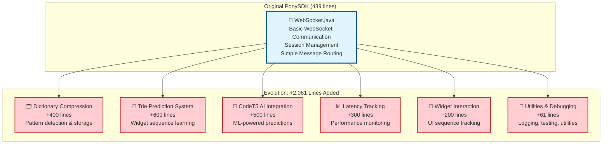
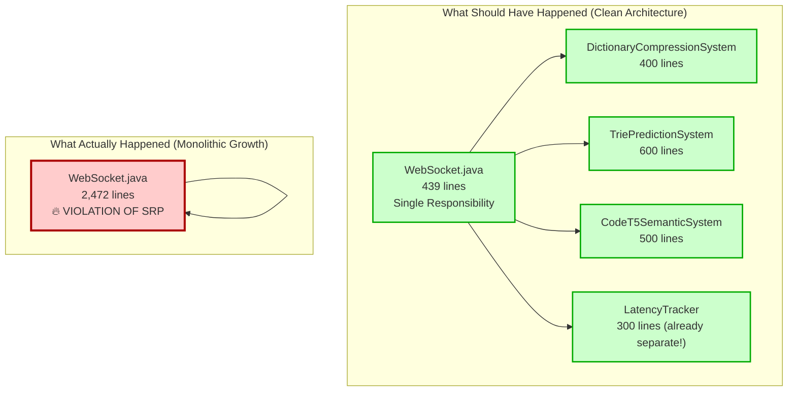
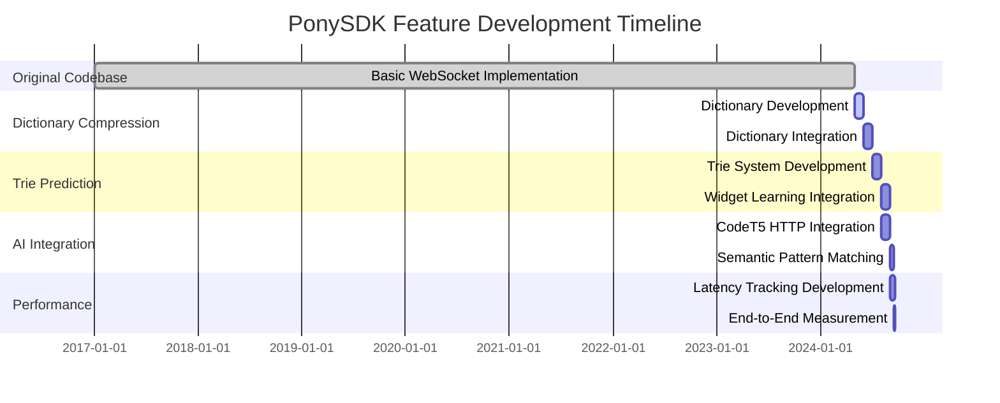

# WebSocket Clean Code Refactoring Analysis

## PonySDK Evolution: From Simple to Complex

### The Dramatic Growth Story

**Original WebSocket.java (master branch):**
- **439 lines** - Simple, focused WebSocket implementation
- **Core functionality only** - Basic message handling
- **Single responsibility** - WebSocket communication

**Current WebSocket.java (CleanCodeFix-20Sep branch):**
- **2,472 lines** - Massive 5.6x growth!
- **2,061 lines added** - Almost entirely new functionality
- **Multiple complex systems** - Dictionary, Trie, CodeT5, Latency tracking

### What Was Added During Development



### New Files Added (Architectural Analysis)

**Core Infrastructure (73 total files changed):**
- **9 new MD documentation files** - Comprehensive architecture docs
- **12 new Java classes** - Support infrastructure
- **3 new sample applications** - Testing frameworks
- **Multiple test classes** - Quality assurance

**Key New Classes Added:**
```java
// Dictionary compression system
ModelValueDictionary.java           // Pattern storage engine
ModelValuePair.java                 // Pattern building blocks
ContentComparator.java              // Pattern comparison logic

// Performance monitoring
LatencyTracker.java                 // End-to-end latency measurement
MetricsExporter.java               // Performance data export

// Client-side enhancements
ClientModelTracker.java            // Client dictionary support
UIBuilder.java (+539 lines)        // Enhanced pattern processing

// Testing infrastructure
DictionaryExtractorTest.java       // Pattern extraction tools
ModelValueDictionaryTest.java      // Dictionary functionality tests
WebSocketPerformanceTest.java      // Latency benchmarking
```

## Clean Architecture Analysis: What Went Wrong

### The Monolithic Monster Pattern

**Root Cause**: All new features were added **directly to WebSocket.java** instead of separate classes.



### Code Evolution Analysis by Feature

#### 1. Dictionary Compression System (+400 lines)
**Added to WebSocket.java lines 80-85, 1200-1400:**
```java
// Should be separate class: DictionaryCompressionSystem.java
private final ModelValueDictionary dictionary = new ModelValueDictionary(2);
private final List<ModelValuePair> currentBatch = new ArrayList<>();
private static final int BATCH_THRESHOLD = 2;
private static boolean dictionaryEnabled = true;

// 400+ lines of dictionary logic mixed with WebSocket concerns
```

**Analysis**: This is a **complete separate system** that happens to use WebSocket for transport. Should be extracted.

#### 2. Trie Prediction System (+600 lines)
**Added to WebSocket.java lines 102-229, 500-800:**
```java
// Should be separate class: TriePredictionSystem.java
private final List<String> widgetInteractionSequence = new ArrayList<>();
private final Map<String, List<ModelValuePair>> widgetMessagePatterns = new HashMap<>();
private static final WidgetTrieNode WIDGET_TRIE = new WidgetTrieNode();
private static final TrieNode DICT_TRIE = new TrieNode();

// Complex trie traversal and prediction logic
static void buildSemanticPatternTrieFromStrings(final List<List<String>> patterns);
static void dumpTrie(TrieNode node, String prefix);
static void dumpWidgetTrie(WidgetTrieNode node, String prefix, String path);
```

**Analysis**: This is **pure computer science algorithm implementation** with zero WebSocket dependency. Perfect candidate for extraction.

#### 3. CodeT5 AI Integration (+500 lines)
**Added to WebSocket.java lines 2000-2400:**
```java
// Should be separate class: CodeT5SemanticSystem.java
private final List<String> currentPatternBuffer = new ArrayList<>();
private String lastPrediction = null;
private final Object predictionLock = new Object();

// HTTP client code for AI service
private String sendJsonPostRequestUsingHttpURLConnection(String jsonPayload);
private void processInstructionForPrediction(final String instruction);
```

**Analysis**: This is **external service integration** with complex HTTP handling. Should definitely be separate.

#### 4. Widget Interaction Tracking (+200 lines)
**Added to WebSocket.java lines 104-116:**
```java
// Should be separate class: WidgetInteractionTracker.java
private final List<String> widgetInteractionSequence = new ArrayList<>();
private final Map<Integer, String> widgetTypeById = new HashMap<>();
private String currentWidgetKey = null;
private String currentWidgetType = null;
private Integer currentWidgetId = null;
```

**Analysis**: This is **UI analytics logic** that could work with any transport mechanism.

## Why This Happened: Development Pressure vs Clean Code

### Development Timeline Reconstruction



### The Pressure Points

**1. Rapid Feature Addition**
- Multiple complex systems added in 4-month period
- Each feature "just added to existing WebSocket class"
- No refactoring time allocated

**2. Interconnected Dependencies**
- Dictionary needs WebSocket for transport
- Trie needs Dictionary for pattern storage
- CodeT5 needs both for context
- Latency tracking needs all systems

**3. Prototype-to-Production Acceleration**
- Features started as experiments
- Successful experiments became permanent
- No architectural cleanup phase

## The Clean Architecture Solution

### Separation Strategy Based on Evolution Analysis

#### Phase 1: Extract Independent Systems (No Dependencies)
```java
// 1. TriePredictionSystem - Pure algorithm, zero dependencies
public class TriePredictionSystem {
    // Lines 102-229, 500-800 from WebSocket.java
    // ~600 lines of pure trie logic
}

// 2. CodeT5SemanticSystem - External service, minimal dependencies
public class CodeT5SemanticSystem {
    // Lines 2000-2400 from WebSocket.java
    // ~500 lines of HTTP and AI logic
}
```

#### Phase 2: Extract Semi-Dependent Systems
```java
// 3. DictionaryCompressionSystem - Needs message transport interface
public class DictionaryCompressionSystem {
    // Lines 80-85, 1200-1400 from WebSocket.java
    // ~400 lines of compression logic
}

// 4. WidgetInteractionTracker - Needs UI event interface
public class WidgetInteractionTracker {
    // Lines 104-116 from WebSocket.java
    // ~200 lines of interaction tracking
}
```

#### Phase 3: Clean Integration Layer
```java
// 5. Clean WebSocket - Back to original responsibility
public class WebSocket implements WebSocketListener, WebsocketEncoder {
    // Back to ~500 lines focused on WebSocket concerns
    private final DictionaryCompressionSystem dictionarySystem;
    private final TriePredictionSystem trieSystem;
    private final CodeT5SemanticSystem aiSystem;
    private final WidgetInteractionTracker widgetTracker;
    private final LatencyTracker latencyTracker; // Already separate!

    // Clean message routing to appropriate systems
}
```

## Success Stories: What Went Right

### 1. LatencyTracker.java - Already Extracted! ✅
**This was done correctly:**
- **562 lines** in separate file
- **Single responsibility** - performance measurement
- **Clean interface** - easy to test and modify
- **Good example** for other extractions

### 2. ModelValueDictionary.java - Partially Extracted ✅
**Core logic separated:**
- **220 lines** in separate file
- **Pure data structure** - no WebSocket dependencies
- **Thread-safe design** - good architecture

### 3. Comprehensive Testing ✅
**Good test coverage:**
- **DictionaryExtractorTest.java** - Dictionary functionality
- **ModelValueDictionaryTest.java** - Core data structures
- **WebSocketPerformanceTest.java** - Performance benchmarks

## Lessons Learned: Development vs Architecture

### What Led to Monolithic Growth

**1. Feature-First Development**
- "Just add it to WebSocket.java" mentality
- No architectural review process
- Prototype code became production code

**2. Tight Coupling Introduction**
- Each new feature depended on WebSocket internals
- No interface-based design
- Direct field access instead of method calls

**3. No Refactoring Milestones**
- Continuous feature addition without cleanup
- Technical debt accumulation
- No "code health" checkpoints

### What Should Happen Going Forward

**1. Extract-First Policy**
- New features start as separate classes
- Integration through interfaces only
- WebSocket becomes orchestrator, not implementer

**2. Architectural Reviews**
- Regular code health assessments
- Refactoring sprints between feature development
- Line count monitoring (>500 lines = review trigger)

**3. Interface-Based Integration**
- All systems communicate through defined interfaces
- No direct field access between systems
- Dependency injection for testing

## Conclusion: From Monolith to Microservices Architecture

The PonySDK WebSocket evolution represents a classic case of **feature-driven growth** without **architectural discipline**. The good news is:

1. **All functionality works correctly** - no broken features
2. **Comprehensive testing exists** - safe to refactor
3. **Clear separation boundaries** - systems are identifiable
4. **Some extraction already done** - LatencyTracker proves it's possible

The **2,061 lines of added functionality** can be cleanly extracted into **4-5 separate systems**, returning WebSocket.java to its original **~500 line focused responsibility**.

This refactoring will improve:
- **Maintainability** - each system easier to understand
- **Testability** - isolated unit testing possible
- **Performance** - independent optimization opportunities
- **Team productivity** - parallel development on separate systems

The architecture evolution from **439 → 2,472 lines** teaches us that **clean code requires discipline** and **regular refactoring**, even when features are working correctly.