# WebSocket LatencyTracker Listener - Recursive Flow Charts

## Overview

These three recursive flow charts show how the **LatencyTracker listener** integrates with the WebSocket system through function calls, showing the exact call paths, recursion patterns, and where each measurement occurs.

---

## Flow Chart 1: Dictionary Compression Listener Integration

```mermaid
flowchart TD
    %% Entry Point
    Start([🎯 Client UI Action])

    %% Server-Side Call Chain
    subgraph "Server-Side (WebSocket.java)"
        direction TB

        Encode["🔵 encode(model, value)<br/>📍 Line 1224<br/>🖥️ SERVER"]

        %% Stage 1: Intercept
        InterceptCall["📊 listener.onInterceptMessage()<br/>📍 Line 1229<br/>📈 LatencyTracker.onInterceptMessage()<br/>🖥️ SERVER"]

        %% Dictionary Processing
        DictEnabled{"🔍 dictionaryEnabled?<br/>📍 Line 1258<br/>🖥️ SERVER"}

        DictLookup["🗂️ dictionary.getPatternId()<br/>📍 Line 1311/1359<br/>🖥️ SERVER"]

        DictLookupCall["📊 listener.onDictionaryLookup()<br/>📍 Line 1315/1362<br/>📈 LatencyTracker.onDictionaryLookup()<br/>🖥️ SERVER"]

        HashCompute["🔑 generateHashKey()<br/>📍 Line 1325/1371<br/>🖥️ SERVER"]

        HashCall["📊 listener.onHashCompute()<br/>📍 Line 1325/1371<br/>📈 LatencyTracker.onHashCompute()<br/>🖥️ SERVER"]

        EncodeStage["📦 websocketPusher.encode()<br/>📍 Line 1266/1296<br/>🖥️ SERVER"]

        EncodeCall["📊 listener.onEncode()<br/>📍 Line 1263/1294<br/>📈 LatencyTracker.onEncode()<br/>🖥️ SERVER"]

        %% Recursive Pattern Detection
        FlushBatch["🔄 flushCurrentBatch()<br/>📍 Line 1705<br/>🖥️ SERVER"]

        RecordPattern["🗂️ dictionary.recordPattern()<br/>📍 Line 1758<br/>🖥️ SERVER"]

        %% Recursion Point 1: Pattern Definition
        RecursiveEncode1["🔄 RECURSIVE: encode(DICTIONARY_PATTERN_START)<br/>📍 Line 1804<br/>🖥️ SERVER"]

        %% Recursion Point 2: Pattern Content
        RecursiveEncode2["🔄 RECURSIVE: encode(pair.getModel(), pair.getValue())<br/>📍 Line 1809<br/>🖥️ SERVER"]

        %% Recursion Point 3: Pattern End
        RecursiveEncode3["🔄 RECURSIVE: encode(DICTIONARY_PATTERN_END)<br/>📍 Line 1814<br/>🖥️ SERVER"]

        %% Transmission Chain
        FrameReady["📊 listener.onOutgoingPonyFrame()<br/>📍 LatencyTracker:168<br/>📈 Tracks frameTypeDistribution<br/>🖥️ SERVER"]

        BytesQueued["📊 listener.onOutgoingPonyFramesBytes()<br/>📍 LatencyTracker:180<br/>📈 Tracks transmission bytes<br/>🖥️ SERVER"]

        FrameSuccess["📊 listener.onFrameWriteSuccess()<br/>📍 LatencyTracker:189<br/>📈 Calculates end-to-end latency<br/>🖥️ SERVER"]
    end

    %% Client-Side Processing
    subgraph "Client-Side (UIBuilder.java)"
        direction TB

        ClientReceive["📥 updateMainTerminal()<br/>📍 Line 111<br/>💻 CLIENT"]

        ClientUpdate["🔄 update(binaryModel, buffer)<br/>📍 Line 233<br/>💻 CLIENT"]

        DictPatternStart["📋 DICTIONARY_PATTERN_START<br/>📍 Line 256<br/>💻 CLIENT"]

        DictPatternRef["🔗 DICTIONARY_REFERENCE<br/>📍 Line 345<br/>💻 CLIENT"]

        %% Client Recursion Point
        PatternReplay["🔄 Pattern Replay Loop<br/>📍 Lines 445-478<br/>💻 CLIENT"]

        PTObjectUpdate["🎯 targetObject.update()<br/>📍 Line 466<br/>💻 CLIENT"]
    end

    %% Flow Connections
    Start --> Encode

    %% Main Flow
    Encode --> InterceptCall
    InterceptCall --> DictEnabled
    DictEnabled -->|Yes| DictLookup
    DictEnabled -->|No| EncodeStage

    %% Dictionary Flow
    DictLookup --> DictLookupCall
    DictLookupCall --> HashCompute
    HashCompute --> HashCall
    HashCall --> EncodeStage

    %% Encoding Flow
    EncodeStage --> EncodeCall
    EncodeCall --> FlushBatch
    FlushBatch --> RecordPattern

    %% Recursive Encoding (Dictionary Pattern Definition)
    RecordPattern --> RecursiveEncode1
    RecursiveEncode1 --> RecursiveEncode2
    RecursiveEncode2 --> RecursiveEncode3

    %% Recursive calls loop back to encode
    RecursiveEncode1 -.->|RECURSIVE CALL| Encode
    RecursiveEncode2 -.->|RECURSIVE CALL| Encode
    RecursiveEncode3 -.->|RECURSIVE CALL| Encode

    %% Transmission Flow
    RecursiveEncode3 --> FrameReady
    FrameReady --> BytesQueued
    BytesQueued --> FrameSuccess

    %% Client Flow
    FrameSuccess --> ClientReceive
    ClientReceive --> ClientUpdate
    ClientUpdate --> DictPatternStart
    ClientUpdate --> DictPatternRef
    DictPatternRef --> PatternReplay
    PatternReplay --> PTObjectUpdate

    %% Client Recursion
    PTObjectUpdate -.->|RECURSIVE PATTERN REPLAY| PatternReplay

    %% Color Coding
    classDef serverSide fill:#e3f2fd,stroke:#1976d2,stroke-width:2px
    classDef clientSide fill:#f3e5f5,stroke:#7b1fa2,stroke-width:2px
    classDef listenerCall fill:#fff3e0,stroke:#f57c00,stroke-width:3px
    classDef recursiveCall fill:#ffebee,stroke:#d32f2f,stroke-width:3px

    class Encode,DictEnabled,DictLookup,HashCompute,EncodeStage,FlushBatch,RecordPattern serverSide
    class ClientReceive,ClientUpdate,DictPatternStart,DictPatternRef,PatternReplay,PTObjectUpdate clientSide
    class InterceptCall,DictLookupCall,HashCall,EncodeCall,FrameReady,BytesQueued,FrameSuccess listenerCall
    class RecursiveEncode1,RecursiveEncode2,RecursiveEncode3 recursiveCall
```

---

## Flow Chart 2: Trie Prediction Listener Integration

```mermaid
flowchart TD
    %% Entry Point
    Start([🎯 Widget Interaction])

    %% Server-Side Trie Processing
    subgraph "Server-Side Trie System (WebSocket.java)"
        direction TB

        TrackWidget["🎯 trackWidgetInteractionData()<br/>📍 Line 1900<br/>🖥️ SERVER"]

        CompleteWidget["🏁 completeCurrentWidgetInteraction()<br/>📍 Line 1953<br/>🖥️ SERVER"]

        TryPredict["🔮 tryPredictNextWidget()<br/>📍 Line 1999<br/>🖥️ SERVER"]

        %% Recursive Trie Operations
        subgraph "Recursive Trie Navigation"
            direction TB

            PrefixCheck["🌳 isPrefixOfKnownTriplet()<br/>📍 Line 495<br/>🖥️ SERVER"]

            PrefixTime["⏱️ System.nanoTime() - START<br/>📍 Line 496<br/>🖥️ SERVER"]

            TrieNavigate["🔍 Navigate Trie Path<br/>📍 Lines 517-523<br/>🖥️ SERVER"]

            %% Recursive Navigation Loop
            TrieRecursion["🔄 RECURSIVE: currentNode.stringChildren.get()<br/>📍 Line 517<br/>🖥️ SERVER"]

            PrefixListener["📊 listener.onTrieQuery()<br/>📍 Line 532<br/>📈 LatencyTracker.onTrieQuery()<br/>🖥️ SERVER"]

            TripletCheck["🎯 isKnownTriplet()<br/>📍 Line 632<br/>🖥️ SERVER"]

            TripletTime["⏱️ System.nanoTime() - START<br/>📍 Line 633<br/>🖥️ SERVER"]

            TripletNavigate["🔍 Navigate Complete Path<br/>📍 Lines 657-664<br/>🖥️ SERVER"]

            %% Another Recursive Loop
            TripletRecursion["🔄 RECURSIVE: currentNode.stringChildren.get()<br/>📍 Line 658<br/>🖥️ SERVER"]

            TripletListener["📊 listener.onTrieQuery()<br/>📍 Line 675<br/>📈 LatencyTracker.onTrieQuery()<br/>🖥️ SERVER"]
        end

        %% Widget Prediction
        WidgetPredCall["📊 listener.onWidgetPrediction()<br/>📍 Line 154<br/>📈 LatencyTracker.onWidgetPrediction()<br/>🖥️ SERVER"]

        %% Trie Learning
        LearnSequence["📚 learnWidgetSequenceInTrie()<br/>📍 Line 1984<br/>🖥️ SERVER"]

        BuildTrie["🏗️ buildSemanticPatternTrieFromStrings()<br/>📍 Line 267<br/>🖥️ SERVER"]

        %% Recursive Trie Building
        TrieBuild["🔄 RECURSIVE: currentNode.stringChildren.computeIfAbsent()<br/>📍 Line 287<br/>🖥️ SERVER"]

        %% Trie Dumping (Debug)
        DumpTrie["🔍 dumpTrie() - DEBUG<br/>📍 Line 779<br/>🖥️ SERVER"]

        DumpRecursion["🔄 RECURSIVE: dumpTrie(child, newPrefix)<br/>📍 Line 804<br/>🖥️ SERVER"]
    end

    %% Message Encoding Integration
    subgraph "Message Encoding (WebSocket.java)"
        direction TB

        EncodeWithTrie["🔵 encode() with Trie Data<br/>📍 Line 1224<br/>🖥️ SERVER"]

        EncodeListener["📊 listener.onEncode()<br/>📍 Line 1263<br/>📈 LatencyTracker.onEncode()<br/>🖥️ SERVER"]
    end

    %% Flow Connections
    Start --> TrackWidget

    %% Widget Tracking Flow
    TrackWidget --> CompleteWidget
    CompleteWidget --> TryPredict

    %% Trie Query Flow
    TryPredict --> PrefixCheck
    PrefixCheck --> PrefixTime
    PrefixTime --> TrieNavigate
    TrieNavigate --> TrieRecursion

    %% Recursive Trie Navigation
    TrieRecursion -.->|RECURSIVE CALL| TrieNavigate
    TrieNavigate --> PrefixListener

    %% Triplet Check Flow
    PrefixListener --> TripletCheck
    TripletCheck --> TripletTime
    TripletTime --> TripletNavigate
    TripletNavigate --> TripletRecursion

    %% Recursive Triplet Navigation
    TripletRecursion -.->|RECURSIVE CALL| TripletNavigate
    TripletNavigate --> TripletListener

    %% Widget Prediction
    TripletListener --> WidgetPredCall

    %% Learning Flow
    WidgetPredCall --> LearnSequence
    LearnSequence --> BuildTrie
    BuildTrie --> TrieBuild

    %% Recursive Trie Building
    TrieBuild -.->|RECURSIVE CALL| BuildTrie

    %% Debug Flow
    BuildTrie --> DumpTrie
    DumpTrie --> DumpRecursion
    DumpRecursion -.->|RECURSIVE CALL| DumpTrie

    %% Encoding Integration
    TryPredict --> EncodeWithTrie
    EncodeWithTrie --> EncodeListener

    %% Color Coding
    classDef serverSide fill:#e8f5e8,stroke:#2e7d32,stroke-width:2px
    classDef trieOperation fill:#f3e5f5,stroke:#7b1fa2,stroke-width:2px
    classDef listenerCall fill:#fff3e0,stroke:#f57c00,stroke-width:3px
    classDef recursiveCall fill:#ffebee,stroke:#d32f2f,stroke-width:3px

    class TrackWidget,CompleteWidget,TryPredict,LearnSequence,EncodeWithTrie serverSide
    class PrefixCheck,TripletCheck,TrieNavigate,TripletNavigate,BuildTrie,DumpTrie trieOperation
    class PrefixListener,TripletListener,WidgetPredCall,EncodeListener listenerCall
    class TrieRecursion,TripletRecursion,TrieBuild,DumpRecursion recursiveCall
```

---

## Flow Chart 3: CodeT5 AI Listener Integration

```mermaid
flowchart TD
    %% Entry Point
    Start([🎯 UI Component Instruction])

    %% Server-Side CodeT5 Processing
    subgraph "Server-Side CodeT5 System (WebSocket.java)"
        direction TB

        ProcessInstruction["🤖 processInstructionForPrediction()<br/>📍 Line 2364<br/>🖥️ SERVER"]

        ExtractComponent["🔍 extractComponentType()<br/>📍 Line 2455<br/>🖥️ SERVER"]

        BufferSync["🔒 synchronized(predictionLock)<br/>📍 Line 2371<br/>🖥️ SERVER"]

        BufferAdd["📝 currentPatternBuffer.add()<br/>📍 Line 2374<br/>🖥️ SERVER"]

        BufferSize{"📏 Buffer Size Check<br/>📍 Lines 2380-2431<br/>🖥️ SERVER"}

        %% Case 1: Single Element
        PrefixCheck1["🔍 isPrefixOfKnownTriplet() - Case 1<br/>📍 Line 2383<br/>🖥️ SERVER"]

        %% Case 2: Two Elements
        PrefixCheck2["🔍 isPrefixOfKnownTriplet() - Case 2<br/>📍 Line 2392<br/>🖥️ SERVER"]

        %% Recursive Pattern Processing
        RecursiveProcess["🔄 RECURSIVE: processInstructionForPrediction()<br/>📍 Line 2401<br/>🖥️ SERVER"]

        %% HTTP Communication
        HTTPRequest["🌐 sendJsonPostRequestUsingHttpURLConnection()<br/>📍 Line 2170<br/>🖥️ SERVER"]

        %% Async Thread Processing
        subgraph "Async HTTP Thread"
            direction TB

            AsyncThread["🧵 new Thread(() -> {...})<br/>📍 Line 2192<br/>🖥️ SERVER"]

            StartTimer["⏱️ System.nanoTime() - START<br/>📍 Line 2193<br/>🖥️ SERVER"]

            HTTPConnection["🔗 HttpURLConnection Setup<br/>📍 Lines 2199-2208<br/>🖥️ SERVER"]

            JSONPayload["📦 JSON Payload Creation<br/>📍 Lines 2210-2215<br/>🖥️ SERVER"]

            HTTPSend["📤 HTTP POST Request<br/>📍 Lines 2217-2221<br/>🖥️ SERVER"]

            HTTPResponse["📥 HTTP Response Processing<br/>📍 Lines 2223-2230<br/>🖥️ SERVER"]

            JSONParse["🔍 JSON Response Parsing<br/>📍 Lines 2235-2241<br/>🖥️ SERVER"]

            SimilarityCalc["📊 calculateSimilarity()<br/>📍 Line 2252<br/>🖥️ SERVER"]

            EndTimer["⏱️ System.nanoTime() - END<br/>📍 Line 2295<br/>🖥️ SERVER"]

            CodeT5Listener["📊 listener.onCodeT5Query()<br/>📍 Line 2297<br/>📈 LatencyTracker.onCodeT5Query()<br/>🖥️ SERVER"]
        end

        %% Case 3: Three Elements
        TripletValidation["✅ Three Element Validation<br/>📍 Line 2409<br/>🖥️ SERVER"]

        KnownTriplet["🔍 isKnownTriplet()<br/>📍 Line 2418<br/>🖥️ SERVER"]

        BuildTrie["🏗️ buildSemanticPatternTrieFromStrings()<br/>📍 Line 2420<br/>🖥️ SERVER"]

        %% Reset and Recursion
        BufferReset["🔄 currentPatternBuffer.clear()<br/>📍 Line 2426<br/>🖥️ SERVER"]

        RecursiveReset["🔄 RECURSIVE: processInstructionForPrediction()<br/>📍 Line 2429<br/>🖥️ SERVER"]
    end

    %% External AI Service
    subgraph "External AI Service"
        direction TB

        FastAPIService["🤖 FastAPI Service<br/>http://127.0.0.1:8000/generate<br/>🌐 EXTERNAL"]

        AIModel["🧠 CodeT5 ML Model<br/>🌐 EXTERNAL"]

        AIResponse["📊 AI Generated Response<br/>🌐 EXTERNAL"]
    end

    %% Client-Side Integration
    subgraph "Client-Side Processing (UIBuilder.java)"
        direction TB

        ClientProcess["🔄 processInstructions()<br/>📍 Line 1062<br/>💻 CLIENT"]

        ClientExecute["⚡ uiContext.execute()<br/>📍 Line 1082<br/>💻 CLIENT"]

        ClientFireData["🔥 uiContext.fireClientData()<br/>📍 Line 1106<br/>💻 CLIENT"]
    end

    %% Flow Connections
    Start --> ProcessInstruction

    %% Main Processing Flow
    ProcessInstruction --> ExtractComponent
    ExtractComponent --> BufferSync
    BufferSync --> BufferAdd
    BufferAdd --> BufferSize

    %% Size-based Flow
    BufferSize -->|Size = 1| PrefixCheck1
    BufferSize -->|Size = 2| PrefixCheck2
    BufferSize -->|Size = 3| TripletValidation

    %% Single Element Flow
    PrefixCheck1 --> HTTPRequest

    %% Two Element Flow
    PrefixCheck2 --> HTTPRequest
    PrefixCheck2 --> RecursiveProcess

    %% Recursive Processing
    RecursiveProcess -.->|RECURSIVE CALL| ProcessInstruction

    %% HTTP Flow
    HTTPRequest --> AsyncThread
    AsyncThread --> StartTimer
    StartTimer --> HTTPConnection
    HTTPConnection --> JSONPayload
    JSONPayload --> HTTPSend
    HTTPSend --> FastAPIService

    %% External AI Processing
    FastAPIService --> AIModel
    AIModel --> AIResponse
    AIResponse --> HTTPResponse

    %% Response Processing
    HTTPResponse --> JSONParse
    JSONParse --> SimilarityCalc
    SimilarityCalc --> EndTimer
    EndTimer --> CodeT5Listener

    %% Three Element Flow
    TripletValidation --> KnownTriplet
    KnownTriplet --> BuildTrie
    BuildTrie --> BufferReset
    BufferReset --> RecursiveReset

    %% Reset Recursion
    RecursiveReset -.->|RECURSIVE CALL| ProcessInstruction

    %% Client Integration
    Start --> ClientProcess
    ClientProcess --> ClientExecute
    ClientExecute --> ClientFireData

    %% Color Coding
    classDef serverSide fill:#e8f5e8,stroke:#2e7d32,stroke-width:2px
    classDef asyncThread fill:#e1f5fe,stroke:#01579b,stroke-width:2px
    classDef externalAI fill:#ffccbc,stroke:#d84315,stroke-width:2px
    classDef clientSide fill:#f3e5f5,stroke:#7b1fa2,stroke-width:2px
    classDef listenerCall fill:#fff3e0,stroke:#f57c00,stroke-width:3px
    classDef recursiveCall fill:#ffebee,stroke:#d32f2f,stroke-width:3px

    class ProcessInstruction,ExtractComponent,BufferSync,BufferAdd,BufferSize,PrefixCheck1,PrefixCheck2,TripletValidation,KnownTriplet,BuildTrie,BufferReset serverSide
    class AsyncThread,StartTimer,HTTPConnection,JSONPayload,HTTPSend,HTTPResponse,JSONParse,SimilarityCalc,EndTimer asyncThread
    class FastAPIService,AIModel,AIResponse externalAI
    class ClientProcess,ClientExecute,ClientFireData clientSide
    class CodeT5Listener listenerCall
    class RecursiveProcess,RecursiveReset recursiveCall
```

---

## Recursive Call Pattern Summary

### 1. Dictionary System Recursion:
- **encode() → encode() → encode()**: Pattern definition creates recursive encoding calls
- **Pattern Replay**: Client-side recursive pattern processing

### 2. Trie System Recursion:
- **Trie Navigation**: Deep recursive tree traversal for pattern matching
- **Trie Building**: Recursive node creation and path building
- **Debug Dumping**: Recursive tree structure visualization

### 3. CodeT5 System Recursion:
- **Buffer Processing**: Recursive buffer reshuffling when patterns don't match
- **Instruction Processing**: Self-calling pattern when buffer is reset

### Listener Integration Layers:

| System | Function Layer | Measurement Layer | Recursion Depth |
|--------|---------------|-------------------|-----------------|
| **Dictionary** | encode() → flushBatch() | onDictionaryLookup() | ~3-5 levels |
| **Trie** | trie navigation | onTrieQuery() | ~10+ levels (configurable) |
| **CodeT5** | HTTP async thread | onCodeT5Query() | ~2-3 levels |

These flow charts show the **exact function call paths** and **recursion patterns** where the LatencyTracker measurements occur!