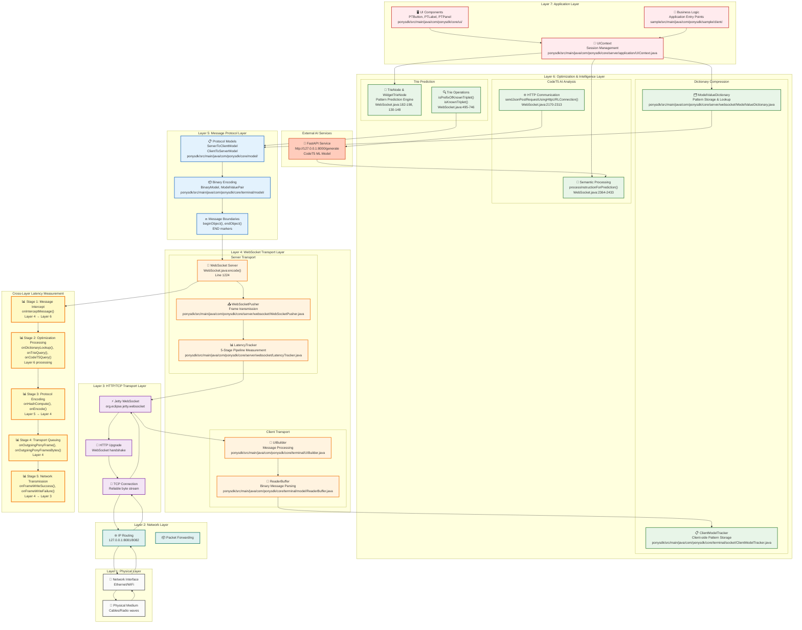

# PonySDK WebSocket Protocol Stack Diagram

## Network Protocol Stack Architecture

This diagram shows the complete PonySDK WebSocket system as a proper **Protocol Stack** with each component placed at its correct networking layer, ensuring proper separation of concerns and clear understanding of where latency measurements occur.

## Layer-by-Layer Component Mapping

### Layer 7: Application Layer
- **Purpose**: Business logic and UI component management
- **Components**: UIContext, PTObject classes, Application entry points
- **Latency Impact**: Minimal (~0.1-0.5ms) - mostly object creation and method calls
- **Key Files**: `UIContext.java`, `sample/client/` classes

### Layer 6: Optimization & Intelligence Layer
- **Purpose**: Pattern recognition, compression, and AI-based prediction
- **Components**: Dictionary, Trie, CodeT5 systems
- **Latency Impact**: Variable (1-500ms depending on AI calls)
- **Key Files**: `ModelValueDictionary.java`, `ClientModelTracker.java`, WebSocket trie methods

### Layer 5: Message Protocol Layer
- **Purpose**: Message structure, encoding, and protocol compliance
- **Components**: ServerToClientModel, BinaryModel, message boundaries
- **Latency Impact**: Low (~0.5-2ms) - binary encoding overhead
- **Key Files**: `ServerToClientModel.java`, `BinaryModel.java`

### Layer 4: WebSocket Transport Layer
- **Purpose**: WebSocket frame management and latency measurement
- **Components**: WebSocket.java, WebSocketPusher, LatencyTracker, UIBuilder
- **Latency Impact**: Critical measurement layer (tracks all 5 stages)
- **Key Files**: `WebSocket.java`, `LatencyTracker.java`, `UIBuilder.java`

### Layer 3: HTTP/TCP Transport Layer
- **Purpose**: Reliable transport and connection management
- **Components**: Jetty WebSocket implementation, TCP streams
- **Latency Impact**: Network dependent (~1-50ms typical)
- **Key Files**: Jetty libraries, system TCP stack

### Layer 2: Network Layer
- **Purpose**: IP routing and packet forwarding
- **Components**: IP stack, routing tables
- **Latency Impact**: Network topology dependent
- **Key Files**: Operating system network stack

### Layer 1: Physical Layer
- **Purpose**: Physical transmission medium
- **Components**: Network interfaces, cables, radio waves
- **Latency Impact**: Speed of light + hardware processing
- **Key Files**: Hardware drivers

## Latency Measurement Cross-Layer Integration

The **LatencyTracker** operates primarily at **Layer 4** but measures performance across multiple layers:

| Stage | Measurement Point | Layers Involved | Typical Latency |
|-------|------------------|-----------------|-----------------|
| **Stage 1** | Message Intercept | 7 → 6 → 4 | ~0.1ms |
| **Stage 2** | Optimization Processing | 6 (Dictionary/Trie/CodeT5) | 1-500ms |
| **Stage 3** | Protocol Encoding | 6 → 5 → 4 | ~0.5-2ms |
| **Stage 4** | Transport Queuing | 4 | ~0.1-1ms |
| **Stage 5** | Network Transmission | 4 → 3 → 2 → 1 | ~1-50ms |

## Protocol Stack Benefits

This layered approach provides:

1. **Clear Separation of Concerns**: Each layer has specific responsibilities
2. **Proper Latency Attribution**: Can identify which layer contributes to delays
3. **Network Engineering Best Practices**: Follows standard protocol stack design
4. **Debugging Efficiency**: Issues can be isolated to specific layers
5. **Performance Optimization**: Can optimize each layer independently

This **Protocol Stack Diagram** is the proper networking terminology and approach for your WebSocket system architecture!