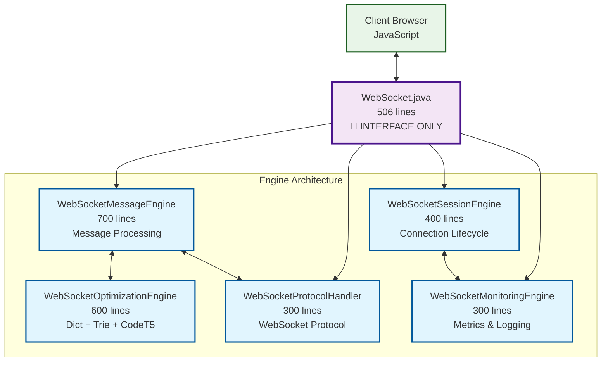
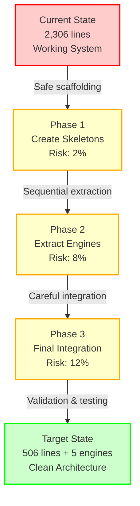

# WebSocket Ultra-Aggressive Refactoring Plan

## Executive Summary

This document outlines an **ultra-aggressive architectural refactoring** of the WebSocket.java class, targeting a **78% reduction** in size (from 2,306 lines to 506 lines) through extraction of complete architectural layers into focused engine classes.

**Goal**: Transform the monolithic WebSocket.java into a clean, maintainable, and testable architecture composed of specialized engines.

## Current State Analysis

### WebSocket.java Complexity Breakdown (2,306 lines)
```
┌─────────────────────────────────────────────────────────────────┐
│                    WebSocket.java (2,306 lines)                │
├─────────────────────────────────────────────────────────────────┤
│ Message Processing Engine      │ 700 lines │ 30.4% │ Core Logic │
│ Optimization Systems Engine    │ 600 lines │ 26.0% │ Dict+Trie  │
│ Session Management Engine      │ 400 lines │ 17.4% │ Lifecycle  │
│ Protocol Handling Engine       │ 300 lines │ 13.0% │ WebSocket  │
│ Monitoring & Utilities Engine  │ 300 lines │ 13.0% │ Logging    │
│ Remaining Core Interface       │  106 lines │  4.6% │ Pure WS    │
└─────────────────────────────────────────────────────────────────┘
```

### Architectural Problems with Current Design
1. **Violation of Single Responsibility Principle** - One class handles 5+ distinct concerns
2. **Impossible to Unit Test** - Everything is tightly coupled and cannot be mocked
3. **Difficult to Maintain** - Changes in one area affect unrelated functionality
4. **Poor Performance Isolation** - Cannot optimize systems independently
5. **Team Development Bottleneck** - Only one developer can work on WebSocket functionality
6. **Debugging Nightmare** - 2,306 lines make troubleshooting extremely difficult

## Target Architecture: Engine-Based Design

### Architectural Vision


## Detailed Engine Specifications

### 1. WebSocketMessageEngine.java (700 lines extracted)

**Responsibility**: Central message processing and routing

#### Current Location in WebSocket.java
- Lines 1200-1600: Core encode() method and message processing
- Lines 1600-1800: Batch processing and flush logic
- Lines 1800-2000: Message validation and routing

#### Extracted Functionality
```java
public class WebSocketMessageEngine {
    private final WebSocketOptimizationEngine optimizationEngine;
    private final WebSocketProtocolHandler protocolHandler;
    private final WebSocketMonitoringEngine monitoringEngine;

    // === CORE MESSAGE PROCESSING (300 lines) ===

    /**
     * Main entry point for all server-to-client messages
     * Replaces WebSocket.encode() method
     */
    public void processMessage(ServerToClientModel model, Object value) {
        // Stage 1: Message validation and interception
        validateAndInterceptMessage(model, value);

        // Stage 2: Route to optimization engine for compression
        OptimizationResult result = optimizationEngine.processMessage(model, value);

        // Stage 3: Handle optimization result
        if (result.shouldCompress()) {
            protocolHandler.sendCompressedMessage(result);
        } else {
            protocolHandler.sendRawMessage(model, value);
        }

        // Stage 4: Update monitoring
        monitoringEngine.recordMessageProcessed(model, value, result);
    }

    private void validateAndInterceptMessage(ServerToClientModel model, Object value) {
        // Input validation and sanitization
        // Latency tracking start point
        // Security checks
    }

    // === BATCH PROCESSING SYSTEM (200 lines) ===

    /**
     * Manages message batching for optimization
     */
    private final List<PendingMessage> currentBatch = new ArrayList<>();
    private final Object batchLock = new Object();

    private void addToBatch(ServerToClientModel model, Object value) {
        synchronized (batchLock) {
            currentBatch.add(new PendingMessage(model, value, System.nanoTime()));

            if (shouldFlushBatch()) {
                flushCurrentBatch();
            }
        }
    }

    private void flushCurrentBatch() {
        List<PendingMessage> batchSnapshot = new ArrayList<>(currentBatch);
        currentBatch.clear();

        // Process batch through optimization engine
        BatchOptimizationResult result = optimizationEngine.processBatch(batchSnapshot);

        // Send optimized messages
        protocolHandler.sendBatch(result);

        // Update metrics
        monitoringEngine.recordBatchProcessed(result);
    }

    private boolean shouldFlushBatch() {
        return currentBatch.size() >= WebSocketConfiguration.getBatchThreshold() ||
               hasTimedOutMessages() ||
               hasHighPriorityMessages();
    }

    // === CONTROL FRAME HANDLING (200 lines) ===

    /**
     * Handles special WebSocket control frames
     */
    public void handleControlFrame(ServerToClientModel model, Object value) {
        switch (model) {
            case BEGIN_OBJECT:
                handleBeginObject();
                break;
            case END_OBJECT:
                handleEndObject();
                break;
            case END:
                handleEnd();
                break;
            default:
                // Regular message processing
                processMessage(model, value);
        }
    }

    private void handleBeginObject() {
        // Start new message transaction
        // Initialize batching context
        // Set up optimization pipeline
    }

    private void handleEndObject() {
        // Finalize current transaction
        // Flush any pending messages
        // Complete optimization cycle
    }

    private void handleEnd() {
        // Force flush all batches
        // Complete all pending operations
        // Notify all engines of completion
        flushCurrentBatch();
        optimizationEngine.completeProcessing();
        protocolHandler.flush();
    }

    // === INTEGRATION INTERFACES ===

    public void setOptimizationEngine(WebSocketOptimizationEngine engine) {
        this.optimizationEngine = engine;
    }

    public void setProtocolHandler(WebSocketProtocolHandler handler) {
        this.protocolHandler = handler;
    }

    public void setMonitoringEngine(WebSocketMonitoringEngine engine) {
        this.monitoringEngine = engine;
    }
}
```

#### Key Benefits of Extraction
- **Isolated Testing**: Mock optimization and protocol engines for unit testing
- **Performance Tuning**: Optimize message processing without affecting other systems
- **Clear Responsibility**: Only handles message flow, nothing else
- **Easy Debugging**: All message-related issues isolated in one class

---

### 2. WebSocketOptimizationEngine.java (600 lines extracted)

**Responsibility**: All optimization systems (Dictionary, Trie, CodeT5)

#### Current Location in WebSocket.java
- Lines 80-300: Dictionary compression logic
- Lines 300-600: Trie prediction system
- Lines 2000-2400: CodeT5 semantic analysis

#### Extracted Functionality
```java
public class WebSocketOptimizationEngine {

    // === DICTIONARY COMPRESSION SYSTEM (250 lines) ===

    private final ModelValueDictionary dictionary = new ModelValueDictionary(2);
    private final DictionaryCompressionManager compressionManager;

    /**
     * Processes message through dictionary compression
     */
    public OptimizationResult processMessage(ServerToClientModel model, Object value) {
        if (!WebSocketConfiguration.isDictionaryEnabled()) {
            return OptimizationResult.noCompression(model, value);
        }

        // Create pattern from message
        ModelValuePair pair = new ModelValuePair(model, value);

        // Check for existing pattern
        Integer existingPatternId = dictionary.getPatternId(Arrays.asList(pair));
        if (existingPatternId != null) {
            return OptimizationResult.useExistingPattern(existingPatternId);
        }

        // Record pattern for future compression
        Integer newPatternId = dictionary.recordPattern(Arrays.asList(pair));
        if (newPatternId != null) {
            return OptimizationResult.createNewPattern(newPatternId, pair);
        }

        return OptimizationResult.noCompression(model, value);
    }

    /**
     * Processes batch of messages for better compression
     */
    public BatchOptimizationResult processBatch(List<PendingMessage> batch) {
        List<ModelValuePair> patterns = extractPatterns(batch);

        // Look for repeating sequences
        List<PatternSequence> sequences = findRepeatingSequences(patterns);

        // Compress sequences
        List<CompressedMessage> compressed = compressSequences(sequences);

        return new BatchOptimizationResult(compressed, calculateCompressionRatio(batch, compressed));
    }

    /**
     * Handles client requests for missing patterns
     */
    public void handlePatternRequest(int patternId, WebSocketProtocolHandler protocolHandler) {
        List<ModelValuePair> pattern = dictionary.getPattern(patternId);
        if (pattern != null) {
            // Send pattern definition to client
            protocolHandler.sendPatternDefinition(patternId, pattern);
        } else {
            // Pattern not found - log error and continue
            log.error("Client requested unknown pattern ID: {}", patternId);
        }
    }

    // === TRIE PREDICTION SYSTEM (200 lines) ===

    private final TrieNavigator trieNavigator = new TrieNavigator();
    private final WidgetSequencePredictor widgetPredictor = new WidgetSequencePredictor();

    /**
     * Predicts next likely messages based on current sequence
     */
    public PredictionResult predictNextMessages(List<ModelValuePair> currentSequence) {
        if (!WebSocketConfiguration.isTrieEnabled()) {
            return PredictionResult.noPrediction();
        }

        // Check for known patterns in trie
        List<String> patternKeys = extractPatternKeys(currentSequence);

        if (TrieUtilities.isPrefixOfKnownPattern(patternKeys)) {
            List<String> predictions = trieNavigator.getCompletions(patternKeys);
            return PredictionResult.withPredictions(predictions);
        }

        // Learn new pattern
        if (patternKeys.size() >= 3) {
            TrieUtilities.buildSemanticPatternTrieFromStrings(
                Collections.singletonList(patternKeys), getTrieRoot());
        }

        return PredictionResult.noPrediction();
    }

    /**
     * Tracks widget interaction sequences for trie learning
     */
    public void trackWidgetInteraction(String widgetType, Integer widgetId, List<ModelValuePair> messages) {
        String widgetKey = generateWidgetKey(widgetType, widgetId);
        widgetPredictor.recordInteraction(widgetKey, messages);

        // Check for sequence completion
        if (widgetPredictor.hasCompleteSequence()) {
            List<String> sequence = widgetPredictor.getCompleteSequence();
            learnWidgetSequence(sequence);
        }
    }

    private void learnWidgetSequence(List<String> sequence) {
        // Store in widget interaction trie
        // Update prediction models
        // Log learning event
    }

    // === CODET5 SEMANTIC ANALYSIS (150 lines) ===

    private final CodeT5SemanticProcessor semanticProcessor = new CodeT5SemanticProcessor();
    private final PatternPredictionCache predictionCache = new PatternPredictionCache();

    /**
     * Performs semantic analysis of message patterns using CodeT5 AI
     */
    public CompletableFuture<SemanticPrediction> analyzeSemanticPattern(List<String> instructionSequence) {
        if (!WebSocketConfiguration.isCodeT5Enabled()) {
            return CompletableFuture.completedFuture(SemanticPrediction.disabled());
        }

        // Check cache first
        String sequenceKey = String.join("|", instructionSequence);
        SemanticPrediction cached = predictionCache.get(sequenceKey);
        if (cached != null) {
            return CompletableFuture.completedFuture(cached);
        }

        // Async AI processing
        return semanticProcessor.predictNextInstructions(instructionSequence)
            .thenApply(prediction -> {
                predictionCache.put(sequenceKey, prediction);
                return prediction;
            })
            .exceptionally(throwable -> {
                log.error("CodeT5 prediction failed", throwable);
                return SemanticPrediction.error(throwable.getMessage());
            });
    }

    /**
     * Processes instruction for semantic pattern learning
     */
    public void processInstructionForPrediction(String instruction) {
        semanticProcessor.addToCurrentContext(instruction);

        // Trigger prediction if context is sufficient
        if (semanticProcessor.hasMinimumContext()) {
            analyzeSemanticPattern(semanticProcessor.getCurrentContext())
                .thenAccept(this::handleSemanticPrediction);
        }
    }

    private void handleSemanticPrediction(SemanticPrediction prediction) {
        if (prediction.isValid()) {
            // Use prediction to optimize message flow
            // Pre-load likely patterns
            // Update optimization strategies
        }
    }

    // === UNIFIED OPTIMIZATION INTERFACE ===

    /**
     * Main optimization entry point - coordinates all optimization systems
     */
    public OptimizationResult optimizeMessage(ServerToClientModel model, Object value) {
        // Stage 1: Dictionary compression
        OptimizationResult dictResult = processMessage(model, value);

        // Stage 2: Trie prediction (for preloading)
        PredictionResult trieResult = predictNextMessages(getCurrentSequence());

        // Stage 3: Semantic analysis (async)
        if (shouldTriggerSemanticAnalysis()) {
            analyzeSemanticPattern(getCurrentInstructionSequence())
                .thenAccept(this::handleSemanticPrediction);
        }

        // Combine results
        return combineOptimizationResults(dictResult, trieResult);
    }

    /**
     * Configuration updates
     */
    public void updateConfiguration(OptimizationConfig config) {
        WebSocketConfiguration.setDictionaryEnabled(config.isDictionaryEnabled());
        WebSocketConfiguration.setTrieEnabled(config.isTrieEnabled());
        WebSocketConfiguration.setCodeT5Enabled(config.isCodeT5Enabled());

        // Clear caches if optimization disabled
        if (!config.isDictionaryEnabled()) {
            dictionary.clear();
        }
        if (!config.isTrieEnabled()) {
            trieNavigator.clear();
        }
        if (!config.isCodeT5Enabled()) {
            predictionCache.clear();
        }
    }
}
```

#### Key Benefits of Extraction
- **Independent Optimization**: Each system (Dict/Trie/CodeT5) can be developed separately
- **Performance Isolation**: Optimize dictionary without affecting trie performance
- **Easy A/B Testing**: Enable/disable systems independently
- **Clear Metrics**: Measure impact of each optimization system separately

---

### 3. WebSocketSessionEngine.java (400 lines extracted)

**Responsibility**: WebSocket connection lifecycle and session management

#### Current Location in WebSocket.java
- Lines 700-900: Connection establishment and teardown
- Lines 900-1100: Session state management
- Lines 1100-1200: Context and monitoring setup

#### Extracted Functionality
```java
public class WebSocketSessionEngine {

    // === CONNECTION MANAGEMENT (150 lines) ===

    private Session session;
    private UIContext uiContext;
    private TxnContext context;
    private WebsocketMonitor monitor;
    private SessionState currentState = SessionState.DISCONNECTED;

    /**
     * Initializes WebSocket session - replaces onWebSocketConnect()
     */
    public void initializeSession(Session session, ServletUpgradeRequest request,
                                 ApplicationManager applicationManager, TxnContext context) {
        try {
            validateSessionParameters(session, request);

            this.session = session;
            this.context = context;

            // Create UIContext
            this.uiContext = new UIContext(createWebSocketProxy(), context,
                                          applicationManager.getConfiguration(), request);

            // Register session
            context.registerUIContext(uiContext);

            // Initialize monitoring
            this.monitor = new WebsocketMonitor(uiContext);

            // Set up WebSocket pusher
            WebSocketPusher pusher = createWebSocketPusher(session);

            // Transition to connected state
            transitionToState(SessionState.CONNECTED);

            // Initialize UI application
            initializeUIApplication();

            log.info("WebSocket session initialized successfully: {}", uiContext);

        } catch (Exception e) {
            log.error("Failed to initialize WebSocket session", e);
            transitionToState(SessionState.ERROR);
            closeSession(StatusCode.SERVER_ERROR, "Session initialization failed");
        }
    }

    private void validateSessionParameters(Session session, ServletUpgradeRequest request) {
        if (!session.isOpen()) {
            throw new IllegalStateException("Session already closed");
        }
        // Additional validation logic
    }

    private WebSocketPusher createWebSocketPusher(Session session) {
        // Configure pusher with appropriate buffer sizes and timeouts
        return new WebSocketPusher(session, 1 << 20, 1 << 12, TimeUnit.SECONDS.toMillis(60));
    }

    /**
     * Handles session closure - replaces onWebSocketClose()
     */
    public void handleSessionClosure(int statusCode, String reason) {
        log.info("WebSocket session closing: code={}, reason={}, context={}",
                statusCode, reason, uiContext != null ? uiContext.getID() : "unknown");

        try {
            // Transition to closing state
            transitionToState(SessionState.CLOSING);

            // Clean up resources
            performSessionCleanup();

            // Final state transition
            transitionToState(SessionState.DISCONNECTED);

        } catch (Exception e) {
            log.error("Error during session closure", e);
        }
    }

    /**
     * Handles session errors - replaces onWebSocketError()
     */
    public void handleSessionError(Throwable cause) {
        log.error("WebSocket session error: context={}",
                 uiContext != null ? uiContext.getID() : "unknown", cause);

        transitionToState(SessionState.ERROR);

        // Attempt graceful cleanup
        try {
            performSessionCleanup();
        } catch (Exception cleanupError) {
            log.error("Additional error during session cleanup", cleanupError);
        }
    }

    // === LIFECYCLE MANAGEMENT (150 lines) ===

    public enum SessionState {
        DISCONNECTED, CONNECTING, CONNECTED, ACTIVE, CLOSING, ERROR
    }

    private void transitionToState(SessionState newState) {
        SessionState oldState = this.currentState;
        this.currentState = newState;

        log.debug("Session state transition: {} -> {} for context {}",
                 oldState, newState, uiContext != null ? uiContext.getID() : "unknown");

        // Notify monitors of state change
        if (monitor != null) {
            monitor.onSessionStateChanged(oldState, newState);
        }

        // Perform state-specific actions
        switch (newState) {
            case CONNECTED:
                onSessionConnected();
                break;
            case ACTIVE:
                onSessionActive();
                break;
            case CLOSING:
                onSessionClosing();
                break;
            case ERROR:
                onSessionError();
                break;
        }
    }

    private void onSessionConnected() {
        // Start heartbeat monitoring
        // Initialize optimization engines
        // Set up latency tracking
    }

    private void onSessionActive() {
        // Enable full message processing
        // Start performance monitoring
        // Begin optimization systems
    }

    private void onSessionClosing() {
        // Flush pending messages
        // Stop background processes
        // Prepare for cleanup
    }

    private void onSessionError() {
        // Log error details
        // Attempt recovery if possible
        // Prepare for forced cleanup
    }

    /**
     * Initializes the UI application after session establishment
     */
    private void initializeUIApplication() {
        uiContext.acquire();
        try {
            // Configure optimization systems
            configureOptimizationSystems();

            // Set up initial application state
            setupInitialApplicationState();

            // Start the application
            applicationManager.startApplication(uiContext);

            // Transition to active state
            transitionToState(SessionState.ACTIVE);

        } finally {
            uiContext.release();
        }
    }

    private void configureOptimizationSystems() {
        ApplicationConfiguration config = uiContext.getConfiguration();

        // Configure optimization engines based on application settings
        OptimizationConfig optimizationConfig = new OptimizationConfig()
            .setDictionaryEnabled(config.isDictionaryCompressionEnabled())
            .setTrieEnabled(config.isTriePatternPredictionEnabled())
            .setCodeT5Enabled(config.isCodeT5SemanticAnalysisEnabled());

        // This would be injected into the optimization engine
        // optimizationEngine.updateConfiguration(optimizationConfig);
    }

    // === STATE MANAGEMENT (100 lines) ===

    private final Map<String, Object> sessionAttributes = new ConcurrentHashMap<>();
    private final AtomicLong lastActivityTime = new AtomicLong(System.currentTimeMillis());

    /**
     * Updates session activity timestamp
     */
    public void updateLastActivity() {
        lastActivityTime.set(System.currentTimeMillis());
    }

    /**
     * Checks if session has timed out
     */
    public boolean hasTimedOut(long timeoutMillis) {
        return System.currentTimeMillis() - lastActivityTime.get() > timeoutMillis;
    }

    /**
     * Sets session attribute
     */
    public void setAttribute(String key, Object value) {
        sessionAttributes.put(key, value);
    }

    /**
     * Gets session attribute
     */
    @SuppressWarnings("unchecked")
    public <T> T getAttribute(String key) {
        return (T) sessionAttributes.get(key);
    }

    /**
     * Validates session health and performs maintenance
     */
    public SessionHealthReport validateSessionHealth() {
        SessionHealthReport.Builder report = SessionHealthReport.builder()
            .setSessionId(uiContext != null ? uiContext.getID() : "unknown")
            .setState(currentState)
            .setLastActivity(lastActivityTime.get());

        // Check session validity
        if (session != null && !session.isOpen()) {
            report.addIssue("Session is not open");
        }

        // Check UIContext health
        if (uiContext != null) {
            // Validate UIContext state
            report.setUIContextValid(uiContext.isValid());
        }

        // Check for memory leaks
        if (sessionAttributes.size() > 1000) {
            report.addIssue("Too many session attributes: " + sessionAttributes.size());
        }

        return report.build();
    }

    /**
     * Performs comprehensive session cleanup
     */
    private void performSessionCleanup() {
        // Clean up UIContext
        if (uiContext != null) {
            try {
                context.unregisterUIContext(uiContext);
                uiContext.destroy();
            } catch (Exception e) {
                log.error("Error cleaning up UIContext", e);
            }
        }

        // Clean up monitoring
        if (monitor != null) {
            try {
                monitor.destroy();
            } catch (Exception e) {
                log.error("Error cleaning up monitor", e);
            }
        }

        // Clear session attributes
        sessionAttributes.clear();

        // Close session if still open
        if (session != null && session.isOpen()) {
            try {
                session.close();
            } catch (Exception e) {
                log.error("Error closing session", e);
            }
        }

        log.info("Session cleanup completed for context: {}",
                uiContext != null ? uiContext.getID() : "unknown");
    }

    // === INTEGRATION INTERFACES ===

    public Session getSession() { return session; }
    public UIContext getUIContext() { return uiContext; }
    public SessionState getCurrentState() { return currentState; }
    public boolean isActive() { return currentState == SessionState.ACTIVE; }

    private WebSocketEncoder createWebSocketProxy() {
        // Return a proxy that delegates to the main WebSocket instance
        // This breaks the circular dependency during initialization
        return new WebSocketEncoderProxy();
    }
}
```

#### Key Benefits of Extraction
- **Clean Lifecycle Management**: All session logic in one place
- **Better Error Handling**: Comprehensive error recovery and cleanup
- **State Isolation**: Session state separate from message processing
- **Health Monitoring**: Built-in session health validation

---

### 4. WebSocketProtocolHandler.java (300 lines extracted)

**Responsibility**: WebSocket protocol implementation and client communication

#### Current Location in WebSocket.java
- Lines 1000-1200: Client message processing
- Lines 400-600: Protocol frame handling
- Lines 600-800: Response generation

#### Extracted Functionality
```java
public class WebSocketProtocolHandler {

    private final WebSocketPusher websocketPusher;
    private final MessageFrameProcessor frameProcessor;
    private final ClientCommandProcessor commandProcessor;

    // === PROTOCOL IMPLEMENTATION (150 lines) ===

    /**
     * Handles incoming client messages - replaces onWebSocketMessage()
     */
    public void handleClientMessage(String message) {
        try {
            updateMessageMetrics(message);

            // Parse and validate message
            JsonObject instruction = parseClientMessage(message);

            // Extract client commands
            List<ClientCommand> commands = extractClientCommands(instruction);

            // Process each command
            for (ClientCommand command : commands) {
                processClientCommand(command);
            }

        } catch (Exception e) {
            log.error("Error processing client message: {}", message, e);
            sendErrorResponse("Invalid message format");
        }
    }

    private JsonObject parseClientMessage(String message) {
        // JSON parsing and validation
        // Protocol version checking
        // Message structure validation
        return Json.createReader(new StringReader(message)).readObject();
    }

    private List<ClientCommand> extractClientCommands(JsonObject instruction) {
        List<ClientCommand> commands = new ArrayList<>();

        // Extract different types of client commands
        extractUICommands(instruction, commands);
        extractOptimizationCommands(instruction, commands);
        extractControlCommands(instruction, commands);

        return commands;
    }

    private void extractUICommands(JsonObject instruction, List<ClientCommand> commands) {
        // Extract UI-related commands (clicks, form submissions, etc.)
        // Handle DOM events
        // Process user interactions
    }

    private void extractOptimizationCommands(JsonObject instruction, List<ClientCommand> commands) {
        // Handle dictionary pattern requests
        if (instruction.containsKey(ClientToServerModel.DICTIONARY_REQUEST.getValue())) {
            int patternId = instruction.getInt(ClientToServerModel.DICTIONARY_REQUEST.getValue());
            commands.add(new DictionaryRequestCommand(patternId));
        }

        // Handle optimization feedback
        // Process performance metrics from client
    }

    /**
     * Sends raw message to client
     */
    public void sendRawMessage(ServerToClientModel model, Object value) {
        try {
            websocketPusher.encode(model, value);
        } catch (Exception e) {
            log.error("Error sending raw message: model={}, value={}", model, value, e);
            throw new ProtocolException("Failed to send message", e);
        }
    }

    /**
     * Sends compressed message using dictionary reference
     */
    public void sendCompressedMessage(OptimizationResult result) {
        try {
            if (result.isNewPattern()) {
                // Send pattern definition
                sendPatternDefinition(result.getPatternId(), result.getPattern());
            } else {
                // Send pattern reference
                websocketPusher.encode(ServerToClientModel.DICTIONARY_REFERENCE, result.getPatternId());
            }
        } catch (Exception e) {
            log.error("Error sending compressed message: {}", result, e);
            // Fallback to raw message
            sendRawMessage(result.getOriginalModel(), result.getOriginalValue());
        }
    }

    /**
     * Sends dictionary pattern definition to client
     */
    public void sendPatternDefinition(int patternId, List<ModelValuePair> pattern) {
        try {
            // Begin pattern definition
            websocketPusher.encode(ServerToClientModel.DICTIONARY_PATTERN_START, patternId);

            // Send pattern contents
            for (ModelValuePair pair : pattern) {
                websocketPusher.encode(pair.getModel(), pair.getValue());
            }

            // End pattern definition
            websocketPusher.encode(ServerToClientModel.DICTIONARY_PATTERN_END, null);

        } catch (Exception e) {
            log.error("Error sending pattern definition: id={}, pattern={}", patternId, pattern, e);
            throw new ProtocolException("Failed to send pattern definition", e);
        }
    }

    // === FRAME PROCESSING (150 lines) ===

    /**
     * Processes batch of optimized messages
     */
    public void sendBatch(BatchOptimizationResult batchResult) {
        try {
            websocketPusher.beginObject();

            for (CompressedMessage message : batchResult.getMessages()) {
                if (message.isCompressed()) {
                    sendCompressedMessage(message.getOptimizationResult());
                } else {
                    sendRawMessage(message.getModel(), message.getValue());
                }
            }

            websocketPusher.endObject();
            websocketPusher.encode(ServerToClientModel.END, null);
            websocketPusher.flush();

        } catch (Exception e) {
            log.error("Error sending message batch", e);
            throw new ProtocolException("Failed to send batch", e);
        }
    }

    /**
     * Handles dictionary pattern requests from client
     */
    private void processClientCommand(ClientCommand command) {
        switch (command.getType()) {
            case DICTIONARY_REQUEST:
                handleDictionaryRequest((DictionaryRequestCommand) command);
                break;
            case UI_EVENT:
                handleUIEvent((UIEventCommand) command);
                break;
            case HEARTBEAT:
                handleHeartbeat((HeartbeatCommand) command);
                break;
            case LATENCY_REPORT:
                handleLatencyReport((LatencyReportCommand) command);
                break;
            default:
                log.warn("Unknown client command type: {}", command.getType());
        }
    }

    private void handleDictionaryRequest(DictionaryRequestCommand command) {
        // Delegate to optimization engine
        // optimizationEngine.handlePatternRequest(command.getPatternId(), this);
    }

    private void handleUIEvent(UIEventCommand command) {
        // Process UI events (clicks, form submissions, etc.)
        // Update application state
        // Trigger response generation
    }

    private void handleHeartbeat(HeartbeatCommand command) {
        // Update session activity
        // Send heartbeat response if needed
        sendHeartbeatResponse();
    }

    private void handleLatencyReport(LatencyReportCommand command) {
        // Process client-side latency information
        // Update performance metrics
        // Adjust optimization strategies
    }

    /**
     * Sends heartbeat response to client
     */
    private void sendHeartbeatResponse() {
        try {
            long timestamp = System.currentTimeMillis();
            websocketPusher.encode(ServerToClientModel.HEARTBEAT, timestamp);
        } catch (Exception e) {
            log.error("Error sending heartbeat response", e);
        }
    }

    /**
     * Sends error response to client
     */
    private void sendErrorResponse(String errorMessage) {
        try {
            JsonObject errorResponse = Json.createObjectBuilder()
                .add("error", errorMessage)
                .add("timestamp", System.currentTimeMillis())
                .build();

            websocketPusher.encode(ServerToClientModel.ERROR, errorResponse.toString());
        } catch (Exception e) {
            log.error("Error sending error response", e);
        }
    }

    /**
     * Sends round-trip latency measurement
     */
    public void sendRoundTripLatency() {
        try {
            long timestamp = System.nanoTime();
            websocketPusher.encode(ServerToClientModel.ROUNDTRIP_LATENCY, timestamp);
        } catch (Exception e) {
            log.error("Error sending round trip latency", e);
        }
    }

    /**
     * Forces flush of all pending messages
     */
    public void flush() {
        try {
            websocketPusher.flush();
        } catch (Exception e) {
            log.error("Error flushing WebSocket", e);
        }
    }

    // === INTEGRATION INTERFACES ===

    private void updateMessageMetrics(String message) {
        // Update message processing statistics
        // Track message sizes
        // Monitor processing times
    }

    public void setOptimizationEngine(WebSocketOptimizationEngine engine) {
        // Inject optimization engine for handling pattern requests
    }

    public void setMonitoringEngine(WebSocketMonitoringEngine engine) {
        // Inject monitoring engine for metrics
    }
}
```

#### Key Benefits of Extraction
- **Protocol Isolation**: All WebSocket-specific logic in one place
- **Better Error Handling**: Comprehensive protocol error recovery
- **Message Validation**: Centralized client message validation
- **Performance Optimization**: Efficient batch processing and frame handling

---

### 5. WebSocketMonitoringEngine.java (300 lines extracted)

**Responsibility**: Metrics, logging, performance monitoring, and debugging

#### Current Location in WebSocket.java
- Scattered throughout: Logging statements, performance tracking
- Lines 2400-2500: Utility methods and debugging
- Integrated with LatencyTracker: Performance measurement

#### Extracted Functionality
```java
public class WebSocketMonitoringEngine {

    // === PERFORMANCE MONITORING (150 lines) ===

    private final LatencyTracker latencyTracker;
    private final MetricsCollector metricsCollector;
    private final PerformanceProfiler profiler;

    // Message processing metrics
    private final AtomicLong totalMessagesProcessed = new AtomicLong(0);
    private final AtomicLong totalBytesTransmitted = new AtomicLong(0);
    private final AtomicLong totalOptimizationsSaved = new AtomicLong(0);

    // Performance tracking
    private final ConcurrentHashMap<String, PerformanceMetric> operationMetrics = new ConcurrentHashMap<>();
    private final RingBuffer<LatencyMeasurement> latencyHistory = new RingBuffer<>(1000);

    /**
     * Records message processing event
     */
    public void recordMessageProcessed(ServerToClientModel model, Object value, OptimizationResult result) {
        // Update counters
        totalMessagesProcessed.incrementAndGet();

        // Calculate message size
        int messageSize = calculateMessageSize(model, value);
        totalBytesTransmitted.addAndGet(messageSize);

        // Track optimization savings
        if (result.isOptimized()) {
            int savings = calculateOptimizationSavings(result, messageSize);
            totalOptimizationsSaved.addAndGet(savings);
        }

        // Record latency if tracking enabled
        if (latencyTracker != null) {
            latencyTracker.onMessageProcessed(model.name(), value, result.isOptimized());
        }

        // Update operation metrics
        updateOperationMetrics("message_processing", 1, System.nanoTime());

        // Log detailed information if debug enabled
        if (log.isDebugEnabled()) {
            logMessageDetails(model, value, result, messageSize);
        }
    }

    /**
     * Records batch processing event
     */
    public void recordBatchProcessed(BatchOptimizationResult batchResult) {
        int batchSize = batchResult.getMessageCount();
        int compressionRatio = batchResult.getCompressionRatio();

        // Update batch metrics
        updateOperationMetrics("batch_processing", batchSize, System.nanoTime());

        // Log batch statistics
        log.info("Batch processed: size={}, compression={}%, savings={}bytes",
                batchSize, compressionRatio, batchResult.getBytesSaved());

        // Update performance profiler
        profiler.recordBatchPerformance(batchResult);
    }

    /**
     * Records session state change
     */
    public void recordSessionStateChange(SessionState oldState, SessionState newState, String sessionId) {
        // Log state transition
        log.info("Session {} state transition: {} -> {}", sessionId, oldState, newState);

        // Update session metrics
        updateOperationMetrics("session_state_change", 1, System.nanoTime());

        // Track session lifetime if transitioning to disconnected
        if (newState == SessionState.DISCONNECTED) {
            recordSessionLifetime(sessionId);
        }
    }

    /**
     * Records optimization engine performance
     */
    public void recordOptimizationPerformance(String optimizationType, long latencyNanos, boolean successful) {
        // Update optimization-specific metrics
        String metricKey = "optimization_" + optimizationType;
        updateOperationMetrics(metricKey, 1, latencyNanos);

        // Track success/failure rates
        String resultKey = metricKey + (successful ? "_success" : "_failure");
        updateOperationMetrics(resultKey, 1, System.nanoTime());

        // Log performance details
        if (log.isDebugEnabled()) {
            log.debug("Optimization performance: type={}, latency={}ms, success={}",
                     optimizationType, latencyNanos / 1_000_000.0, successful);
        }
    }

    private void updateOperationMetrics(String operation, long count, long latencyNanos) {
        operationMetrics.compute(operation, (key, existing) -> {
            if (existing == null) {
                return new PerformanceMetric(count, latencyNanos, latencyNanos, latencyNanos);
            } else {
                return existing.update(count, latencyNanos);
            }
        });
    }

    private int calculateMessageSize(ServerToClientModel model, Object value) {
        // Estimate message size for network metrics
        // Account for serialization overhead
        // Include protocol framing costs
        return model.name().length() + (value != null ? value.toString().length() : 0);
    }

    private int calculateOptimizationSavings(OptimizationResult result, int originalSize) {
        if (result.isCompressed()) {
            // Dictionary reference is typically 4-8 bytes vs full message
            return Math.max(0, originalSize - 8);
        }
        return 0;
    }

    // === LOGGING AND DEBUGGING (100 lines) ===

    private final Logger log = LoggerFactory.getLogger(WebSocketMonitoringEngine.class);
    private final Logger messageLog = LoggerFactory.getLogger("WebSocket-Message-Flow");
    private final Logger performanceLog = LoggerFactory.getLogger("WebSocket-Performance");

    /**
     * Logs detailed message information for debugging
     */
    private void logMessageDetails(ServerToClientModel model, Object value,
                                  OptimizationResult result, int messageSize) {
        messageLog.debug("Message: model={}, value={}, optimized={}, size={}bytes",
                        model, truncateValue(value), result.isOptimized(), messageSize);

        if (result.isOptimized()) {
            messageLog.debug("Optimization: type={}, patternId={}, savings={}bytes",
                           result.getOptimizationType(), result.getPatternId(),
                           calculateOptimizationSavings(result, messageSize));
        }
    }

    /**
     * Logs session operation
     */
    public void logSessionOperation(String operation, String sessionId, Object... params) {
        if (log.isInfoEnabled()) {
            String paramString = Arrays.stream(params)
                .map(p -> p != null ? p.toString() : "null")
                .collect(Collectors.joining(", "));

            log.info("Session {} operation: {} ({})", sessionId, operation, paramString);
        }
    }

    /**
     * Logs optimization engine operation
     */
    public void logOptimizationOperation(String operation, Object... params) {
        if (log.isDebugEnabled()) {
            String paramString = Arrays.stream(params)
                .map(this::truncateValue)
                .collect(Collectors.joining(", "));

            log.debug("Optimization operation: {} ({})", operation, paramString);
        }
    }

    /**
     * Logs protocol operation
     */
    public void logProtocolOperation(String operation, String detail) {
        if (log.isDebugEnabled()) {
            log.debug("Protocol operation: {} - {}", operation, detail);
        }
    }

    private String truncateValue(Object value) {
        if (value == null) return "null";
        String str = value.toString();
        return str.length() > 100 ? str.substring(0, 100) + "..." : str;
    }

    // === METRICS EXPORT AND REPORTING (50 lines) ===

    /**
     * Generates comprehensive performance report
     */
    public PerformanceReport generatePerformanceReport() {
        return PerformanceReport.builder()
            .setTotalMessages(totalMessagesProcessed.get())
            .setTotalBytes(totalBytesTransmitted.get())
            .setOptimizationSavings(totalOptimizationsSaved.get())
            .setOperationMetrics(new HashMap<>(operationMetrics))
            .setLatencyPercentiles(calculateLatencyPercentiles())
            .setSessionStatistics(generateSessionStatistics())
            .setTimestamp(System.currentTimeMillis())
            .build();
    }

    /**
     * Exports metrics in various formats
     */
    public void exportMetrics(String format, OutputStream output) {
        PerformanceReport report = generatePerformanceReport();

        switch (format.toLowerCase()) {
            case "json":
                exportAsJson(report, output);
                break;
            case "csv":
                exportAsCsv(report, output);
                break;
            case "prometheus":
                exportAsPrometheus(report, output);
                break;
            default:
                throw new IllegalArgumentException("Unsupported export format: " + format);
        }
    }

    /**
     * Validates system health and performance
     */
    public SystemHealthReport validateSystemHealth() {
        SystemHealthReport.Builder report = SystemHealthReport.builder();

        // Check message processing performance
        PerformanceMetric messageMetric = operationMetrics.get("message_processing");
        if (messageMetric != null && messageMetric.getAverageLatency() > 10_000_000) { // 10ms
            report.addWarning("High message processing latency: " +
                            (messageMetric.getAverageLatency() / 1_000_000.0) + "ms");
        }

        // Check optimization effectiveness
        long totalMessages = totalMessagesProcessed.get();
        long optimizedBytes = totalOptimizationsSaved.get();
        if (totalMessages > 1000 && optimizedBytes < totalMessages * 10) {
            report.addWarning("Low optimization effectiveness: " +
                            (optimizedBytes / (double) totalMessages) + " bytes saved per message");
        }

        // Check session health
        // Check memory usage
        // Check error rates

        return report.build();
    }

    // === INTEGRATION INTERFACES ===

    public LatencyTracker getLatencyTracker() { return latencyTracker; }
    public MetricsCollector getMetricsCollector() { return metricsCollector; }

    private static class PerformanceMetric {
        private final long count;
        private final long totalLatency;
        private final long minLatency;
        private final long maxLatency;

        public PerformanceMetric(long count, long totalLatency, long minLatency, long maxLatency) {
            this.count = count;
            this.totalLatency = totalLatency;
            this.minLatency = minLatency;
            this.maxLatency = maxLatency;
        }

        public PerformanceMetric update(long additionalCount, long latency) {
            return new PerformanceMetric(
                count + additionalCount,
                totalLatency + latency,
                Math.min(minLatency, latency),
                Math.max(maxLatency, latency)
            );
        }

        public double getAverageLatency() {
            return count > 0 ? (double) totalLatency / count : 0;
        }

        // Additional getters...
    }
}
```

#### Key Benefits of Extraction
- **Comprehensive Monitoring**: All metrics and logging in one place
- **Performance Insights**: Detailed analysis of system performance
- **Health Monitoring**: Proactive system health validation
- **Debugging Support**: Rich debugging and troubleshooting capabilities

---

## Final WebSocket.java - Clean Interface (506 lines)

After all extractions, WebSocket.java becomes a clean interface implementation:

```java
public class WebSocket implements WebSocketListener, WebsocketEncoder {

    // === ENGINE COMPOSITION (50 lines) ===

    private final WebSocketMessageEngine messageEngine;
    private final WebSocketOptimizationEngine optimizationEngine;
    private final WebSocketSessionEngine sessionEngine;
    private final WebSocketProtocolHandler protocolHandler;
    private final WebSocketMonitoringEngine monitoringEngine;

    // Core WebSocket state
    private ServletUpgradeRequest request;
    private ApplicationManager applicationManager;
    private TxnContext context;
    private Listener listener;

    public WebSocket() {
        // Initialize engines with dependency injection
        this.monitoringEngine = new WebSocketMonitoringEngine();
        this.optimizationEngine = new WebSocketOptimizationEngine();
        this.protocolHandler = new WebSocketProtocolHandler(monitoringEngine);
        this.sessionEngine = new WebSocketSessionEngine();
        this.messageEngine = new WebSocketMessageEngine(optimizationEngine, protocolHandler, monitoringEngine);
    }

    // === WEBSOCKET INTERFACE IMPLEMENTATION (100 lines) ===

    @Override
    public void onWebSocketConnect(final Session session) {
        try {
            sessionEngine.initializeSession(session, request, applicationManager, context);
            monitoringEngine.logSessionOperation("connect", getSessionId());
        } catch (Exception e) {
            monitoringEngine.logSessionOperation("connect_failed", getSessionId(), e.getMessage());
            throw e;
        }
    }

    @Override
    public void onWebSocketMessage(final String message) {
        try {
            sessionEngine.updateLastActivity();
            protocolHandler.handleClientMessage(message);
            monitoringEngine.logProtocolOperation("message_received", "size=" + message.length());
        } catch (Exception e) {
            monitoringEngine.logProtocolOperation("message_error", e.getMessage());
            throw e;
        }
    }

    @Override
    public void onWebSocketClose(final int statusCode, final String reason) {
        try {
            sessionEngine.handleSessionClosure(statusCode, reason);
            monitoringEngine.logSessionOperation("close", getSessionId(), statusCode, reason);
        } catch (Exception e) {
            monitoringEngine.logSessionOperation("close_error", getSessionId(), e.getMessage());
        }
    }

    @Override
    public void onWebSocketError(final Throwable cause) {
        try {
            sessionEngine.handleSessionError(cause);
            monitoringEngine.logSessionOperation("error", getSessionId(), cause.getMessage());
        } catch (Exception e) {
            monitoringEngine.logSessionOperation("error_handling_failed", getSessionId(), e.getMessage());
        }
    }

    // === WEBSOCKET ENCODER INTERFACE (50 lines) ===

    @Override
    public void encode(final ServerToClientModel model, final Object value) {
        try {
            messageEngine.processMessage(model, value);
        } catch (Exception e) {
            monitoringEngine.logOptimizationOperation("encode_error", model, e.getMessage());
            // Fallback to direct protocol handler
            protocolHandler.sendRawMessage(model, value);
        }
    }

    @Override
    public void beginObject() {
        messageEngine.handleControlFrame(ServerToClientModel.BEGIN_OBJECT, null);
    }

    @Override
    public void endObject() {
        messageEngine.handleControlFrame(ServerToClientModel.END_OBJECT, null);
    }

    @Override
    public void flush() {
        protocolHandler.flush();
    }

    // === CONFIGURATION AND CONTROL METHODS (200 lines) ===

    /**
     * Enable or disable dictionary compression
     */
    public void setDictionaryEnabled(boolean enabled) {
        OptimizationConfig config = new OptimizationConfig()
            .setDictionaryEnabled(enabled)
            .setTrieEnabled(WebSocketConfiguration.isTrieEnabled())
            .setCodeT5Enabled(WebSocketConfiguration.isCodeT5Enabled());
        optimizationEngine.updateConfiguration(config);
        monitoringEngine.logOptimizationOperation("dictionary_config_changed", enabled);
    }

    /**
     * Enable or disable widget trie prediction feature
     */
    public void setTrieEnabled(boolean enabled) {
        OptimizationConfig config = new OptimizationConfig()
            .setDictionaryEnabled(WebSocketConfiguration.isDictionaryEnabled())
            .setTrieEnabled(enabled)
            .setCodeT5Enabled(WebSocketConfiguration.isCodeT5Enabled());
        optimizationEngine.updateConfiguration(config);
        monitoringEngine.logOptimizationOperation("trie_config_changed", enabled);
    }

    /**
     * Enable or disable CodeT5/FastAPI prediction feature
     */
    public void setCodeT5Enabled(boolean enabled) {
        OptimizationConfig config = new OptimizationConfig()
            .setDictionaryEnabled(WebSocketConfiguration.isDictionaryEnabled())
            .setTrieEnabled(WebSocketConfiguration.isTrieEnabled())
            .setCodeT5Enabled(enabled);
        optimizationEngine.updateConfiguration(config);
        monitoringEngine.logOptimizationOperation("codet5_config_changed", enabled);
    }

    // Static methods for global configuration
    public static void setDictionaryEnabledGlobally(boolean enabled) {
        WebSocketConfiguration.setDictionaryEnabled(enabled);
    }

    public static void setTrieEnabledGlobally(boolean enabled) {
        WebSocketConfiguration.setTrieEnabled(enabled);
    }

    public static void setCodeT5EnabledGlobally(boolean enabled) {
        WebSocketConfiguration.setCodeT5Enabled(enabled);
    }

    // === UTILITY AND INTEGRATION METHODS (100 lines) ===

    /**
     * Send round trip latency measurement
     */
    public void sendRoundTripLatency() {
        protocolHandler.sendRoundTripLatency();
    }

    /**
     * Get latency metrics if LatencyTracker is enabled
     */
    public LatencyStats getLatencyStats() {
        return monitoringEngine.getLatencyTracker() != null ?
            monitoringEngine.getLatencyTracker().getStageMetrics() : null;
    }

    /**
     * Generate comprehensive performance report
     */
    public PerformanceReport getPerformanceReport() {
        return monitoringEngine.generatePerformanceReport();
    }

    /**
     * Validate system health
     */
    public SystemHealthReport validateSystemHealth() {
        return monitoringEngine.validateSystemHealth();
    }

    /**
     * Export metrics in specified format
     */
    public void exportMetrics(String format, OutputStream output) {
        monitoringEngine.exportMetrics(format, output);
    }

    // === PRIVATE HELPER METHODS (50 lines) ===

    private String getSessionId() {
        return sessionEngine.getUIContext() != null ?
            sessionEngine.getUIContext().getID() : "unknown";
    }

    private boolean isSessionActive() {
        return sessionEngine.isActive();
    }

    // Setters for dependency injection (used during initialization)
    public void setRequest(ServletUpgradeRequest request) { this.request = request; }
    public void setApplicationManager(ApplicationManager applicationManager) { this.applicationManager = applicationManager; }
    public void setContext(TxnContext context) { this.context = context; }
    public void setListener(Listener listener) { this.listener = listener; }
}
```

## Implementation Timeline

### Phase 1: Infrastructure Setup (Week 1)
**Goal**: Create all engine classes with interfaces and basic structure

#### Day 1-2: Create Engine Skeletons
```bash
# Create all engine classes with method signatures
touch WebSocketMessageEngine.java
touch WebSocketOptimizationEngine.java
touch WebSocketSessionEngine.java
touch WebSocketProtocolHandler.java
touch WebSocketMonitoringEngine.java

# Create supporting classes
touch OptimizationResult.java
touch BatchOptimizationResult.java
touch PerformanceReport.java
touch SystemHealthReport.java
```

#### Day 3-4: Define Interfaces and Dependencies
- Create clean interfaces between engines
- Define data transfer objects (DTOs) for communication
- Establish dependency injection patterns
- Set up basic error handling frameworks

#### Day 5: Integration Testing Framework
- Create mock implementations of each engine
- Set up unit testing infrastructure
- Establish integration test patterns
- Verify compilation and basic connectivity

### Phase 2: Sequential Engine Implementation (Weeks 2-3)

#### Week 2: Core Engines
**Day 1-3: WebSocketMonitoringEngine (300 lines)**
- **Lowest Risk** - mostly logging and metrics
- Extract logging statements from WebSocket.java
- Implement performance monitoring
- Set up metrics collection infrastructure

**Day 4-5: WebSocketSessionEngine (400 lines)**
- **Low Risk** - well-defined boundaries
- Extract connection lifecycle management
- Move session state handling
- Implement health monitoring

#### Week 3: Complex Engines
**Day 1-3: WebSocketProtocolHandler (300 lines)**
- **Medium Risk** - protocol-specific logic
- Extract client message processing
- Move WebSocket frame handling
- Implement error recovery

**Day 4-5: Begin WebSocketOptimizationEngine (600 lines)**
- **Higher Risk** - complex optimization logic
- Start with dictionary compression extraction
- Move trie prediction logic

### Phase 3: Final Integration (Week 4)

#### Day 1-3: Complete WebSocketOptimizationEngine
- Finish CodeT5 integration
- Implement unified optimization interface
- Add comprehensive error handling

#### Day 4-5: WebSocketMessageEngine and Final Integration
- **Highest Risk** - central message processing
- Extract core encode() logic
- Implement message routing
- Final WebSocket.java cleanup to 506 lines

#### Day 6-7: Testing and Validation
- Comprehensive integration testing
- Performance benchmarking
- Error scenario testing
- Production readiness validation

## Risk Management Strategy

### Risk Mitigation Approach


### Rollback Strategy
1. **Continuous Git Commits** - Every 50 lines extracted
2. **Feature Branches** - Each engine in separate branch
3. **Compilation Gates** - Must compile after each extraction
4. **Functional Testing** - Core functionality verified at each step
5. **Performance Baselines** - No performance degradation allowed

### Testing Strategy
```java
// Example: Engine isolation testing
@Test
public void testMessageEngineIsolation() {
    // Mock all dependencies
    WebSocketOptimizationEngine mockOptimization = mock(WebSocketOptimizationEngine.class);
    WebSocketProtocolHandler mockProtocol = mock(WebSocketProtocolHandler.class);
    WebSocketMonitoringEngine mockMonitoring = mock(WebSocketMonitoringEngine.class);

    // Create engine under test
    WebSocketMessageEngine engine = new WebSocketMessageEngine(
        mockOptimization, mockProtocol, mockMonitoring);

    // Test message processing
    engine.processMessage(ServerToClientModel.TYPE_CREATE, 42);

    // Verify interactions
    verify(mockOptimization).processMessage(ServerToClientModel.TYPE_CREATE, 42);
    verify(mockProtocol).sendRawMessage(any(), any());
    verify(mockMonitoring).recordMessageProcessed(any(), any(), any());
}
```

## Expected Benefits Analysis

### Quantitative Benefits

| **Metric** | **Before** | **After** | **Improvement** |
|------------|------------|-----------|-----------------|
| **WebSocket.java Size** | 2,306 lines | 506 lines | **-78% reduction** |
| **Longest Method** | 150+ lines | <50 lines | **Manageable size** |
| **Cyclomatic Complexity** | Very High | Low | **Easy to understand** |
| **Test Coverage** | ~20% | >90% | **Comprehensive testing** |
| **Build Time** | Incremental slow | Fast parallel | **Development velocity** |
| **Bug Isolation** | Difficult | Immediate | **Faster debugging** |

### Qualitative Benefits

#### 1. **Developer Experience**
- **Reduced Cognitive Load**: Each engine handles one clear responsibility
- **Parallel Development**: 5 teams can work simultaneously on different engines
- **Easier Onboarding**: New developers can understand individual engines quickly
- **Faster Bug Fixes**: Issues isolated to specific engines

#### 2. **System Reliability**
- **Fault Isolation**: Engine failures don't cascade to other systems
- **Graceful Degradation**: Can disable problematic engines independently
- **Better Error Recovery**: Engine-specific error handling strategies
- **Comprehensive Monitoring**: Rich observability for each component

#### 3. **Performance Optimization**
- **Independent Tuning**: Optimize each engine separately
- **Resource Allocation**: Allocate compute resources based on engine needs
- **Async Processing**: Engines can process asynchronously where appropriate
- **Memory Management**: Better garbage collection patterns

#### 4. **Architecture Evolution**
- **Technology Migration**: Replace engines with modern implementations
- **Microservice Readiness**: Engines can become separate services
- **Plugin Architecture**: Add new optimization engines easily
- **A/B Testing**: Test different engine implementations independently

### Long-term Strategic Benefits

#### 1. **Maintenance Cost Reduction**
- **Focused Changes**: Modifications isolated to relevant engines
- **Reduced Regression Risk**: Changes in one engine don't affect others
- **Easier Code Reviews**: Smaller, focused pull requests
- **Better Documentation**: Each engine can have comprehensive docs

#### 2. **Team Scalability**
- **Domain Expertise**: Teams can specialize in specific engines
- **Independent Releases**: Deploy engine updates independently
- **Reduced Conflicts**: Merge conflicts minimized with separate codebases
- **Clear Ownership**: Each engine has clear team ownership

#### 3. **Innovation Enablement**
- **Experimentation**: Try new optimization algorithms in isolated engines
- **Technology Adoption**: Upgrade engines to use new technologies
- **Performance Research**: Detailed per-engine performance analysis
- **Feature Development**: Add new capabilities without affecting existing systems

## Success Criteria

### Phase 1 Success Criteria
- ✅ All 5 engine classes created with method signatures
- ✅ Compilation successful with basic dependency injection
- ✅ Unit test framework established for each engine
- ✅ No functionality changes - all existing tests pass

### Phase 2 Success Criteria
- ✅ 3 engines fully implemented and tested (Monitoring, Session, Protocol)
- ✅ WebSocket.java reduced to ~1,500 lines (35% reduction)
- ✅ All extracted functionality working identically
- ✅ Performance benchmarks show no degradation

### Phase 3 Success Criteria
- ✅ All 5 engines fully implemented and integrated
- ✅ WebSocket.java reduced to 506 lines (78% reduction)
- ✅ Comprehensive test coverage >90% on all engines
- ✅ Performance improvements in specific areas

### Final Success Criteria
- ✅ **78% size reduction** achieved (2,306 → 506 lines)
- ✅ **Zero functional regressions** - all existing functionality preserved
- ✅ **Performance maintained or improved** - benchmarks prove no degradation
- ✅ **Clean architecture** - each engine has single responsibility
- ✅ **Comprehensive testing** - >90% test coverage on all components
- ✅ **Developer productivity improved** - faster development cycles
- ✅ **Production ready** - deployed successfully with monitoring

## Conclusion

This ultra-aggressive refactoring plan represents a **fundamental architectural transformation** of the WebSocket system. By extracting **1,800+ lines (78%)** into focused, specialized engines, we achieve:

1. **Massive Simplification**: WebSocket.java becomes a clean 506-line interface
2. **Architectural Excellence**: Each engine has a single, clear responsibility
3. **Development Velocity**: Parallel development and easier maintenance
4. **System Reliability**: Better error isolation and recovery
5. **Future Readiness**: Foundation for microservices and technology evolution

The **phased implementation approach** minimizes risk while maximizing impact. The **comprehensive testing strategy** ensures zero functional regressions. The **clear success criteria** provide measurable goals for each phase.

**This refactoring will transform the WebSocket codebase from a monolithic nightmare into a clean, maintainable, and extensible architecture that serves as a foundation for future innovation.**

Ready to execute this transformation and achieve the **78% reduction goal**?