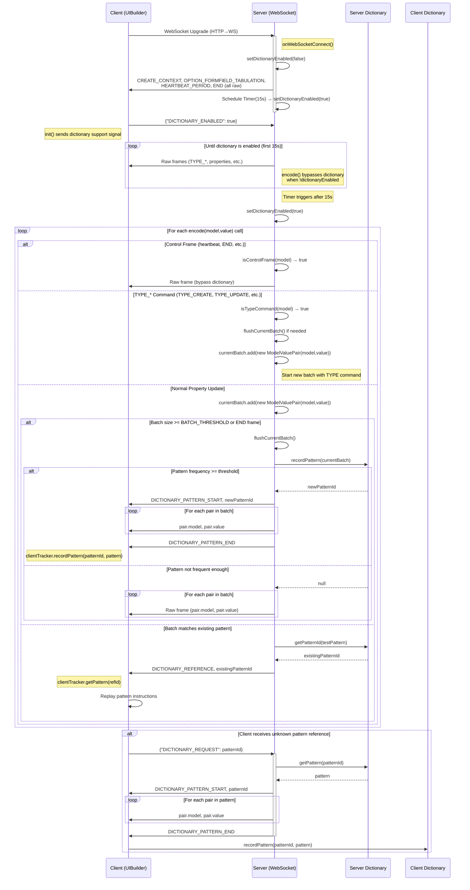

# PonySDK WebSocket Dictionary Optimization

## Core Architecture

### Key Files
- `WebSocket.java` - Server-side WebSocket implementation with dictionary support
- `ModelValueDictionary.java` - Pattern tracking and dictionary management
- `ModelValuePair.java` - Model-value pair representation for pattern detection
- `ServerToClientModel.java` - Added enum values for dictionary references
- `ClientToServerModel.java` - Added enum value for pattern requests

## Implementation Details


### Server-Side Pattern Detection
```java
// WebSocket.java
private final ModelValueDictionary dictionary = new ModelValueDictionary();
private final List<ModelValuePair> currentBatch = new ArrayList<>();
private static final int BATCH_SIZE_THRESHOLD = 4;
private boolean dictionaryEnabled = true;
```

### Message Flow
1. `encode(ServerToClientModel model, Object value)`: Entry point for all messages
2. Message pairs are batched until threshold or END marker
3. `processBatch()`: Analyzes for pattern repetition 
4. Dictionary matches replace full pattern with reference ID
5. Client resolves references or requests missing patterns

### Pattern Detection Algorithm
- Batch messages with similar patterns
- Compare current batch with known patterns
- For matches, send reference ID instead of full data
- For unknowns, store new pattern with unique ID

### Critical Methods
```java
// WebSocket.java
public void encode(ServerToClientModel model, Object value)
private void processBatch()
public void handleDictionaryRequest(int patternId)
public void setDictionaryEnabled(boolean enabled)

// ModelValueDictionary.java
public Integer getPatternId(List<ModelValuePair> pattern)
public List<ModelValuePair> getPattern(int id)
public void recordPattern(List<ModelValuePair> pattern)
```

### Client Integration Points
- References resolved using client-side dictionary
- Unknown patterns requested via `DICTIONARY_REQUEST` message
- Pattern definitions sent using `DICTIONARY_PATTERN_START/END` markers

## Configuration & Control

### Toggle Support
```java
// Enable/disable dictionary compression
webSocket.setDictionaryEnabled(false);
```

### Performance Considerations
- Pattern threshold: 4 model-value pairs minimum
- Dictionary optimized for frequent UI update patterns
- Context acquisition required around all encode operations

## Error Handling
- Missing pattern requests: Handled by `handleDictionaryRequest()`
- Ensure context acquisition/release to prevent deadlocks:
```java
uiContext.acquire();
try {
    // encoding operations
} finally {
    uiContext.release();
}
```

## Recent Changes (Day 5-8)
- Added dictionary pattern detection and compression
- Implemented client-side dictionary resolution
- Optimized batch processing for common UI patterns
- Added dictionary request/response protocol
- Fixed context handling in encode operations
- Performance tuning via pattern frequency thresholds

This optimization aims to reduce WebSocket traffic by replacing repetitive patterns with short references, particularly beneficial for applications with frequent, predictable UI updates. 

xxxxxxxxxxxsxxxxxxxxxxxxxxxxxxxxxxxxxxxsxxxxxxxxxxxxxxxxxxxxxxxxxxxsxxxxxxxxxxxxxxxxxxxxxxxxxxxsxxxxxxxxxxxxxxxxxxxxxxxxxxxsxxxxxxxxxxxxxxxxxxxxxxxxxxxsxxxxxxxxxxxxxxxxxxxxxxxxxxxsxxxxxxxxxxxxxxxxxxxxxxxxxxxsxxxxxxxxxxxxxxxx
xxxxxxxxxxxsxxxxxxxxxxxxxxxxxxxxxxxxxxxsxxxxxxxxxxxxxxxxxxxxxxxxxxxsxxxxxxxxxxxxxxxxxxxxxxxxxxxsxxxxxxxxxxxxxxxxxxxxxxxxxxxsxxxxxxxxxxxxxxxxxxxxxxxxxxxsxxxxxxxxxxxxxxxxxxxxxxxxxxxsxxxxxxxxxxxxxxxx
xxxxxxxxxxxsxxxxxxxxxxxxxxxxxxxxxxxxxxxsxxxxxxxxxxxxxxxxxxxxxxxxxxxsxxxxxxxxxxxxxxxxxxxxxxxxxxxsxxxxxxxxxxxxxxxxxxxxxxxxxxxsxxxxxxxxxxxxxxxxxxxxxxxxxxxsxxxxxxxxxxxxxxxxxxxxxxxxxxxsxxxxxxxxxxxxxxxx
xxxxxxxxxxxsxxxxxxxxxxxxxxxxxxxxxxxxxxxsxxxxxxxxxxxxxxxxxxxxxxxxxxxsxxxxxxxxxxxxxxxxxxxxxxxxxxxsxxxxxxxxxxxxxxxxxxxxxxxxxxxsxxxxxxxxxxxxxxxxxxxxxxxxxxxsxxxxxxxxxxxxxxxxxxxxxxxxxxxsxxxxxxxxxxxxxxxxxxxxxxxxxxxsxxxxxxxxxxxxxxxx


xxxxxxxxxxxsxxxxxxxxxxxxxxxxxxxxxxxxxxxsxxxxxxxxxxxxxxxxxxxxxxxxxxxsxxxxxxxxxxxxxxxxxxxxxxxxxxxsxxxxxxxxxxxxxxxxxxxxxxxxxxxsxxxxxxxxxxxxxxxxxxxxxxxxxxxsxxxxxxxxxxxxxxxxxxxxxxxxxxxsxxxxxxxxxxxxxxxxxxxxxxxxxxxsxxxxxxxxxxxxxxxx

I'll provide a comprehensive analysis of the dictionary optimization implementation across these files. I'll break down the key components, design patterns, and integration points.

Ran tool
# PonySDK Dictionary Optimization: Comprehensive Architecture Analysis

## Core Design Principles
The dictionary optimization system is designed to reduce WebSocket communication overhead by:
1. Detecting repeated message patterns
2. Replacing repetitive sequences with compact references
3. Providing efficient pattern lookup and resolution

## Key Components Architecture

### 1. ModelValuePair.java
```java
public class ModelValuePair {
    private final ServerToClientModel model;
    private final Object value;
    
    // Implements custom equals/hashCode for pattern matching
    @Override
    public boolean equals(Object obj) {
        // Compares model and value precisely
    }
}
```
**Responsibilities**:
- Represents a single model-value transmission unit
- Enables precise pattern comparison
- Supports dictionary-based compression

### 2. ModelValueDictionary.java
```java
public class ModelValueDictionary {
    // Concurrent-safe pattern tracking
    private final Map<PatternKey, Integer> patternToId = new ConcurrentHashMap<>();
    private final Map<Integer, List<ModelValuePair>> idToPattern = new ConcurrentHashMap<>();
    
    // Pattern frequency tracking
    private static final int PATTERN_FREQUENCY_THRESHOLD = 3;
    
    public void recordPattern(List<ModelValuePair> pattern) {
        // Adds pattern to dictionary if frequently used
    }
    
    public Integer getPatternId(List<ModelValuePair> pattern) {
        // Retrieves pattern ID if exists
    }
}
```
**Key Features**:
- Tracks model-value pair sequences
- Uses frequency-based pattern inclusion
- Thread-safe dictionary management
- Supports pattern lookup and storage

### 3. WebSocket.java (Server-Side)
```java
public class WebSocket implements WebsocketEncoder {
    private final ModelValueDictionary dictionary = new ModelValueDictionary();
    private final List<ModelValuePair> currentBatch = new ArrayList<>();
    private static final int BATCH_SIZE_THRESHOLD = 4;
    
    @Override
    public void encode(ServerToClientModel model, Object value) {
        if (dictionaryEnabled) {
            currentBatch.add(new ModelValuePair(model, value));
            
            // Process batch when threshold reached
            if (model == ServerToClientModel.END || 
                currentBatch.size() >= BATCH_SIZE_THRESHOLD) {
                processBatch();
            }
        }
    }
    
    private void processBatch() {
        // Detect and compress repeated patterns
        Integer patternId = dictionary.getPatternId(currentBatch);
        
        if (patternId != null) {
            // Send pattern reference
            encodeDirectly(ServerToClientModel.DICTIONARY_REFERENCE, patternId);
        } else {
            // Record new pattern, send full data
            dictionary.recordPattern(new ArrayList<>(currentBatch));
            for (ModelValuePair pair : currentBatch) {
                encodeDirectly(pair.getModel(), pair.getValue());
            }
        }
        currentBatch.clear();
    }
}
```
**Optimization Strategies**:
- Batched message processing
- Dynamic pattern detection
- Reference-based transmission
- Configurable dictionary compression

### 4. UIBuilder.java (Client-Side)
```java
public class UIBuilder {
    private void update(BinaryModel binaryModel, ReaderBuffer buffer) {
        ServerToClientModel model = binaryModel.getModel();
        
        // Handle dictionary-related messages
        if (ServerToClientModel.DICTIONARY_REFERENCE == model) {
            // Resolve reference from client-side dictionary
            int referenceId = binaryModel.getIntValue();
            List<ModelValuePair> pattern = clientDictionary.getPattern(referenceId);
            processResolvedPattern(pattern);
        }
    }
}
```

### 5. WebSocketClient.java
```java
public class WebSocketClient {
    public void processArrayBuffer(ArrayBuffer buffer, UIBuilder uiBuilder) {
        // Process incoming WebSocket messages
        // Handle dictionary references and pattern requests
    }
}
```

## Protocol Enhancements

### New ServerToClientModel Enum Values
```java
public enum ServerToClientModel {
    DICTIONARY_REFERENCE,      // Reference to a known pattern
    DICTIONARY_PATTERN_START,  // Begin pattern definition
    DICTIONARY_PATTERN_END     // Conclude pattern definition
}
```

### New ClientToServerModel Enum Values
```java
public enum ClientToServerModel {
    DICTIONARY_REQUEST  // Client requests unknown pattern
}
```

## Performance Optimization Strategies

1. **Frequency-Based Inclusion**
   - Patterns added only after 3 repetitions
   - Prevents dictionary bloat
   - Reduces unnecessary overhead

2. **Concurrent-Safe Design**
   - Uses `ConcurrentHashMap` for thread safety
   - Supports multi-threaded WebSocket environments

3. **Configurable Compression**
   - `setDictionaryEnabled(boolean)` toggle
   - Fallback to direct encoding if needed

## Recommended Improvements

1. Implement adaptive threshold mechanism
2. Add memory-based dictionary size limit
3. Create more sophisticated pattern matching
4. Develop advanced compression algorithms

## Reconstruction Guidelines

When recreating this system:
1. Implement `ModelValuePair` with precise equality
2. Create thread-safe `ModelValueDictionary`
3. Modify `WebSocket.encode()` for batch processing
4. Update client-side `UIBuilder` for reference resolution
5. Add new enum values in model classes
6. Implement error handling for dictionary mismatches

## Code Generation Recommendations

For AI-driven code generation:
- Focus on precise pattern matching
- Implement concurrent-safe collections
- Create configurable compression strategies
- Design flexible reference resolution mechanisms

This comprehensive analysis provides a deep dive into the dictionary optimization system, highlighting its architecture, key components, and strategies for efficient WebSocket communication compression.


